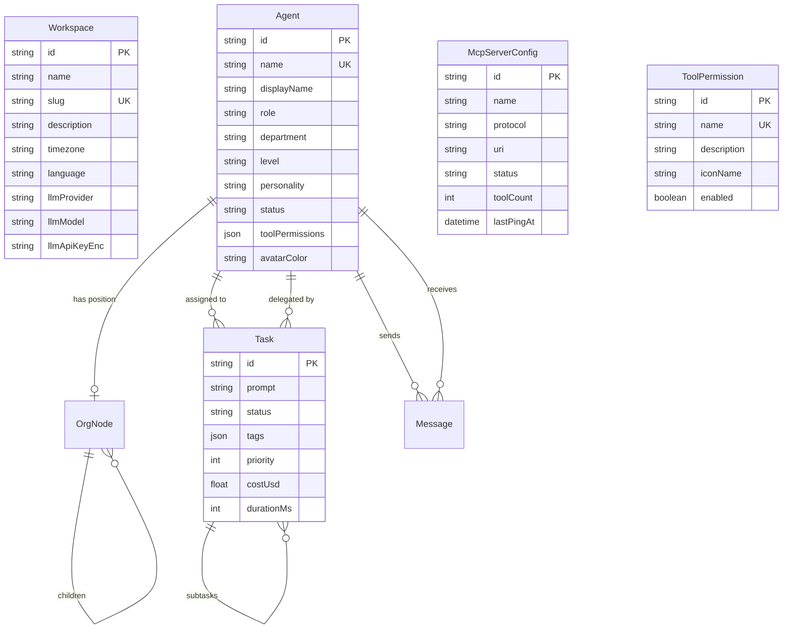

# Mockup Frontend ↔ Backend Feature Parity

## Enhancement Summary

**Deepened on:** 2026-02-01
**Sections enhanced:** All 5 phases + data model + architecture
**Research agents used:** 11 (agent-native audit, architecture strategist, security sentinel, performance oracle, code simplicity reviewer, agent-native reviewer, TypeScript reviewer, data integrity guardian, pattern recognition specialist, best practices researcher, framework docs researcher)

### Critical Plan Revisions (from agent consensus)

Multiple agents independently flagged the same issues. These revisions represent **strong consensus** across reviewers:

1. **REMOVE `Task.column` field** — Derive kanban column from existing `Task.status`. Adding a parallel categorization field creates split-brain state. (Architecture Strategist, Code Simplicity, Data Integrity Guardian, Type Design Analyzer — 4/11 agents)

2. **REMOVE `Agent.systemPrompt` field** — System prompt is dynamically assembled per invocation from `personality` + context + briefing. Adding a static override violates the prompt-native architecture principle. Use the existing `personality` field instead. (Architecture Strategist, Agent-Native Reviewer — 2/11 agents)

3. **RECONCEPTUALIZE Skills model** — The mockup's "skills" (bash, deploy, monitoring) are actually **tool permissions**, not the architecture's prompt-based skills. Rename to `ToolPermission` or simplify to a JSON array on Agent. (Architecture Strategist, Code Simplicity Reviewer, Agent-Native Reviewer — 3/11 agents)

4. **Use Prisma `Json` type for tags** — NOT `String`. Enables PostgreSQL jsonb querying, GIN indexing, and type safety. (Performance Oracle, TypeScript Reviewer, Data Integrity Guardian, Best Practices Researcher — 4/11 agents)

5. **Encrypt API keys** — Never store plaintext. Use AES-256-GCM with `node:crypto` or the existing `LocalEnvVaultPlugin`. (Security Sentinel, Architecture Strategist, Data Integrity Guardian — 3/11 agents)

6. **Add ~20 missing MCP tools** — Original plan proposed 8 tools; full CRUD coverage requires 24-30 for agent-native parity (80%+ score). (Agent-Native Audit, Agent-Native Reviewer — 2/11 agents)

7. **Fix P0 performance issues BEFORE new features** — Missing database indexes on Task/Message, O(n^2) org tree construction bug in existing code. (Performance Oracle — 1/11 agents, but blocking)

### New Considerations Discovered

- **Board naming collision**: existing file-based `/api/board` conflicts with proposed kanban `/api/tasks/board` — need clear namespace separation
- **Routes.ts at 784 lines**: must split before adding 15+ endpoints — use domain-based router files
- **Missing context injection**: new subsystems (workspace, skills, MCP servers) not injected into agent system prompt briefings
- **Missing WebSocket events**: need `workspace_updated`, `skill_changed`, `mcp_server_status_changed`
- **Existing cascade bug**: Agent deletion fails on existing Task/Message FKs — fix during this work
- **Use TanStack Query for server state, Zustand for UI state only** — don't create new Zustand stores for API data

---

## Overview

The `frontend-mockup/` directory contains a redesigned React frontend with significantly more features than the current `apps/dashboard/` + `apps/server/` implementation supports. This plan itemizes every gap between what the mockup expects and what the backend currently provides, then lays out a phased implementation strategy to reach full parity.

The mockup is a static React app (React Router DOM, Tailwind CSS, Lucide icons) with **all data hardcoded**. It needs to be wired to real API endpoints and WebSocket events. Some features it shows already exist in the backend; others require new endpoints, new data models, or entirely new subsystems.

## Problem Statement

The current backend (`apps/server/`) was built for the v2 architecture and supports: agents, tasks, messages, org nodes, board items, and real-time WebSocket events. The mockup frontend adds several feature surfaces that have **no backend support**:

1. **Workspace Settings** — name, slug, description, timezone, language (no `Workspace` model exists)
2. **LLM Provider Configuration** — provider, model, API key management (currently hardcoded in env vars)
3. **MCP Server Registry** — list/add/remove external MCP servers with health monitoring (MCP is currently in-process only)
4. **Tool Permissions** — workspace-level and per-agent tool permission toggles (what the mockup calls "skills")
5. **Kanban Task Board** — the mockup shows a proper kanban with columns (Backlog, In Progress, Review, Done), priorities (P1/P2/P3), tags, assignee avatars, search, filters, and list/board view toggle. The current backend has tasks but the column view should derive from task status.
6. **Agent Configuration** — per-agent personality editing, per-agent tool permission toggles from the org chart detail modal
7. **Agent Messages Tab** — direct messaging UI within the agent detail modal (partially exists)
8. **Billing, Security, Notifications settings pages** — scaffolded in mockup but not detailed

## Gap Analysis

### Legend
- **Backend exists** = endpoint/model already in place, just need frontend wiring
- **Backend partial** = some data exists but needs new fields or endpoints
- **Backend missing** = entirely new subsystem needed

### Feature-by-Feature Gap Table

| # | Mockup Feature | Mockup Route | Backend Status | Work Required |
|---|---------------|-------------|---------------|---------------|
| 1 | Dashboard (welcome page) | `/dashboard` | Missing | New frontend page only (no backend needed, uses existing endpoints) |
| 2 | Chat thread list | `/chat` | **Exists** | Frontend migration (current dashboard already has this) |
| 3 | Chat conversation | `/chat/conversation` | **Exists** | Frontend migration + file attachment display support |
| 4 | Org chart tree | `/org-chart` | **Exists** | Frontend migration (current dashboard has React Flow) |
| 5 | Agent detail — Live Activity | `/org-chart/agent` | **Exists** | Frontend migration |
| 6 | Agent detail — Status | `/org-chart/agent/status` | **Partial** | Need aggregated agent metrics endpoint (uptime, spend today, tasks completed) |
| 7 | Agent detail — Task History | `/org-chart/agent/tasks` | **Exists** | Frontend migration (add cost/duration display) |
| 8 | Agent detail — Context | `/org-chart/agent/context` | **Exists** | Frontend migration |
| 9 | Agent detail — Messages | `/org-chart/agent/messages` | **Partial** | Need per-agent thread listing, direct message UI |
| 10 | Agent detail — Config | `/org-chart/agent/config` | **Missing** | Need: per-agent tool permission toggles, tool permission registry |
| 11 | Task Board (Kanban) | `/board` | **Partial** | Need: task tags (Json), status-to-column mapping, search/filter, assignee display name, list view |
| 12 | Settings — General | `/settings` | **Missing** | Need: Workspace model + CRUD endpoints |
| 13 | Settings — LLM Provider | `/settings` (section) | **Missing** | Need: LLM config storage + endpoints (encrypted API key) |
| 14 | Settings — Agents | `/settings/agents` | **Partial** | Need: aggregated cost per agent, online count stats |
| 15 | Settings — MCP Servers | `/settings/mcp-servers` | **Missing** | Need: MCP server registry model + CRUD + health check |
| 16 | Settings — Skills | `/settings/skills` | **Missing** | Need: tool permission registry + CRUD + toggle endpoints |
| 17 | Settings — Billing | `/settings/billing` | **Missing** | Placeholder page, deferred |
| 18 | Settings — Security | `/settings/security` | **Missing** | Placeholder page, deferred |
| 19 | Settings — Notifications | `/settings/notifications` | **Missing** | Placeholder page, deferred |
| 20 | Sidebar navigation | all routes | **Partial** | New layout with settings nav, connection status indicator |

---

## Technical Approach

### Architecture

All new backend work follows the existing patterns:
- Express REST routes with Zod validation
- Prisma models for persistent state
- `appEventBus` emissions for every mutation
- WebSocket broadcast via `WebSocketHub`
- Corresponding MCP tools for agent-native parity (Action Parity principle)

### Research Insights — Architecture

**Route Organization (Pattern Recognition Specialist):**
- `routes.ts` is already 784 lines. Before adding 15+ new endpoints, split into domain-based router files:
  - `routes/workspace.ts`
  - `routes/skills.ts` (tool permissions)
  - `routes/mcp-servers.ts`
  - `routes/tasks.ts` (move existing + new board endpoints)
  - `routes/agents.ts` (move existing + new config endpoints)
  - `routes/messages.ts` (move existing)
  - `routes/org-nodes.ts` (move existing)
- Mount with `app.use("/api", workspaceRouter)` etc.

**Zod Schema Extraction (TypeScript Reviewer):**
- Extract the 7 inline Zod schemas from routes.ts into `apps/server/src/api/schemas/` before adding more
- One file per domain: `workspace.schema.ts`, `task.schema.ts`, etc.
- Export schemas AND inferred types: `export type CreateTaskInput = z.infer<typeof createTaskSchema>`

**Event Naming (Pattern Recognition Specialist):**
- Existing events have inconsistencies: `org_changed` vs `org_updated`, `board_item_created` emitted for updates
- Adopt consistent `{entity}_{action}` pattern: `workspace_updated`, `skill_created`, `mcp_server_updated`
- Add new events to `AppEventMap` interface for type safety

**Context Injection (Agent-Native Audit):**
- New subsystems MUST be included in agent system prompt briefings
- When building system prompt per invocation, inject: available tool permissions, MCP server status, workspace config
- This is required for agent-native principle #3 (Context Injection)

### Data Model Changes (Prisma)

> **REVISED based on agent consensus** — Several originally proposed fields and models have been removed or reconceptualized.

New models and fields required:

```prisma
model Workspace {
  id          String   @id @default(uuid())
  name        String
  slug        String   @unique
  description String   @default("")
  timezone    String   @default("America/New_York")
  language    String   @default("en-US")

  // LLM Provider config
  llmProvider    String  @default("anthropic")
  llmModel       String  @default("claude-sonnet-4-20250514")
  llmApiKeyEnc   String  @default("")  // AES-256-GCM encrypted
  llmApiKeyIv    String  @default("")  // Initialization vector
  llmApiKeyTag   String  @default("")  // Auth tag

  createdAt   DateTime @default(now())
  updatedAt   DateTime @updatedAt
}

model McpServerConfig {
  id           String   @id @default(uuid())
  name         String
  protocol     String   // "stdio" | "sse" | "http"
  uri          String   // e.g. "stdio://github-mcp-server"
  status       String   @default("disconnected") // "connected" | "disconnected" | "error"
  toolCount    Int      @default(0)
  lastPingAt   DateTime?
  errorMessage String?
  iconName     String?  // for UI display
  iconColor    String?
  createdAt    DateTime @default(now())
  updatedAt    DateTime @updatedAt

  @@index([status])
}

model ToolPermission {
  id          String   @id @default(uuid())
  name        String   @unique    // e.g. "bash", "deploy", "monitoring"
  description String
  iconName    String              // lucide icon name
  enabled     Boolean  @default(true)  // workspace-level default
  createdAt   DateTime @default(now())
  updatedAt   DateTime @updatedAt
}
```

Changes to existing models:

```prisma
model Agent {
  // ... existing fields ...
  // systemPrompt field NOT added — use existing `personality` field
  // System prompt is dynamically assembled per invocation
  toolPermissions  Json     @default("{}") // NEW: {toolPermissionId: boolean} overrides
  avatarColor      String?  // NEW: hex color for avatar display
}

model Task {
  // ... existing fields ...
  tags         Json     @default("[]")    // NEW: [{label: string, color: string, bg: string}]
  // column field NOT added — derive from status:
  //   pending → Backlog, running → In Progress, review → Review, completed/failed → Done

  @@index([assigneeId])
  @@index([status])
  @@index([createdAt])
}

model Message {
  // ... existing fields ...
  @@index([threadId])
  @@index([fromAgentId])
  @@index([toAgentId])
  @@index([createdAt])
}
```

### Research Insights — Data Model

**Why no `Task.column` field (Architecture Strategist + Data Integrity Guardian):**
- Adding `column` alongside `status` creates split-brain state — a task could be `status: "completed"` but `column: "in_progress"`
- The mockup's kanban columns map directly to status values:
  - Backlog = `pending` (no agent assigned or not started)
  - In Progress = `running`
  - Review = `review` (new status value — add to enum)
  - Done = `completed` or `failed`
- If we need a "review" status, add it to the existing status enum rather than creating a parallel field
- Frontend derives column purely from status — single source of truth

**Why no `Agent.systemPrompt` field (Architecture Strategist):**
- The v2 architecture explicitly assembles system prompts dynamically: identity + role + personality + context briefing + available tools
- A static `systemPrompt` override bypasses context injection and violates prompt-native principle
- The existing `personality` field already provides the customizable portion
- What the mockup shows as "System Prompt" in the config tab is a read-only display of the assembled prompt, not an editable override

**Why `ToolPermission` instead of `Skill` + `AgentSkill` (Code Simplicity Reviewer):**
- The mockup's "skills" (bash, deploy, monitoring, etc.) are tool permissions, not the architecture's prompt-based skills
- A simple `ToolPermission` table + JSON field on Agent is simpler than a full join table
- `Agent.toolPermissions` stores `{"bash": true, "deploy": false}` — overrides workspace defaults
- Eliminates the `AgentSkill` join table entirely

**Tags as `Json` type (Performance Oracle + TypeScript Reviewer):**
- Prisma `Json` maps to PostgreSQL `jsonb` which supports GIN indexing
- Enables queries like: `WHERE tags @> '[{"label": "P1"}]'`
- Type-safe with Zod validation at the API boundary:
  ```typescript
  const tagSchema = z.object({
    label: z.string(),
    color: z.string(),
    bg: z.string(),
  });
  const tagsSchema = z.array(tagSchema);
  ```

**API Key Encryption (Security Sentinel):**
```typescript
import { createCipheriv, createDecipheriv, randomBytes } from "node:crypto";

const ALGO = "aes-256-gcm";
const KEY = Buffer.from(process.env.ENCRYPTION_KEY!, "hex"); // 32 bytes

function encrypt(plaintext: string): { enc: string; iv: string; tag: string } {
  const iv = randomBytes(16);
  const cipher = createCipheriv(ALGO, KEY, iv);
  const encrypted = Buffer.concat([cipher.update(plaintext, "utf8"), cipher.final()]);
  return {
    enc: encrypted.toString("hex"),
    iv: iv.toString("hex"),
    tag: cipher.getAuthTag().toString("hex"),
  };
}

function decrypt(enc: string, iv: string, tag: string): string {
  const decipher = createDecipheriv(ALGO, KEY, Buffer.from(iv, "hex"));
  decipher.setAuthTag(Buffer.from(tag, "hex"));
  return decipher.update(enc, "hex", "utf8") + decipher.final("utf8");
}
```

**Missing Indexes (Performance Oracle — P0):**
- Task: `@@index([assigneeId])`, `@@index([status])`, `@@index([createdAt])`
- Message: `@@index([threadId])`, `@@index([fromAgentId])`, `@@index([toAgentId])`, `@@index([createdAt])`
- These are P0 — add in the same migration as new fields

**Existing O(n^2) Bug (Performance Oracle — P0):**
- Org tree construction in the current code iterates all nodes for each node to find children
- Fix: build adjacency map in single pass, then recurse from root
- Must fix before adding more load to the system

### ERD



> **Note:** The ERD omits the `Workspace → Agent` FK intentionally. For v0 (single-tenant), all agents belong to the implicit single workspace. Add the FK when multi-tenancy is implemented.

---

## Pre-Implementation Phase: P0 Fixes

> **Added by Performance Oracle and Pattern Recognition Specialist.** These must be completed before new feature work to prevent compounding existing issues.

### P0.1 Add Missing Database Indexes

Add indexes to existing Task and Message models in a standalone migration:

```prisma
model Task {
  @@index([assigneeId])
  @@index([status])
  @@index([createdAt])
}

model Message {
  @@index([threadId])
  @@index([fromAgentId])
  @@index([toAgentId])
  @@index([createdAt])
}
```

### P0.2 Fix O(n^2) Org Tree Construction

The current org tree builder iterates all nodes per node. Replace with adjacency map:

```typescript
function buildOrgTree(nodes: OrgNode[]): OrgTree {
  const childrenMap = new Map<string | null, OrgNode[]>();
  for (const node of nodes) {
    const parentId = node.parentId ?? null;
    if (!childrenMap.has(parentId)) childrenMap.set(parentId, []);
    childrenMap.get(parentId)!.push(node);
  }

  function buildSubtree(parentId: string | null): OrgTreeNode[] {
    return (childrenMap.get(parentId) ?? []).map((node) => ({
      ...node,
      children: buildSubtree(node.id),
    }));
  }

  return buildSubtree(null);
}
```

### P0.3 Split routes.ts into Domain Routers

Split the 784-line monolith before adding new endpoints:

```
apps/server/src/api/
├── routes.ts          → slim entrypoint that mounts sub-routers
├── routes/
│   ├── agents.ts
│   ├── tasks.ts
│   ├── messages.ts
│   ├── org-nodes.ts
│   ├── board.ts       → existing file-based board
│   └── threads.ts
└── schemas/
    ├── agent.schema.ts
    ├── task.schema.ts
    └── message.schema.ts
```

### P0.4 Fix Agent Deletion Cascade

Existing bug: deleting an agent fails due to FK constraints on Task and Message. Add `onDelete` rules:

```prisma
model Task {
  assignee    Agent?   @relation("assignedTasks", fields: [assigneeId], references: [id], onDelete: SetNull)
  delegatedBy Agent?   @relation("delegatedTasks", fields: [delegatedById], references: [id], onDelete: SetNull)
}
```

---

## Implementation Phases

### Phase 1: Foundation — Workspace & Settings Backend

New Prisma models and API endpoints for workspace configuration. This unblocks the entire Settings section of the mockup.

#### 1.1 Workspace Model + CRUD

**Files to create/modify:**
- `apps/server/prisma/schema.prisma` — Add `Workspace` model
- `apps/server/src/api/routes/workspace.ts` — New router file
- `apps/server/src/api/schemas/workspace.schema.ts` — Zod schemas
- `apps/server/src/services/crypto.ts` — API key encryption utilities
- `packages/shared/src/index.ts` — Add workspace types

**API Endpoints:**
```
GET    /api/workspace         → Get workspace settings (auto-create if none)
PATCH  /api/workspace         → Update workspace settings
DELETE /api/workspace         → Delete workspace (danger zone)
```

**Tests:**
- `apps/server/src/__tests__/api/workspace.test.ts`

**Acceptance Criteria:**
- [ ] Workspace model exists in Prisma with all fields from mockup (name, slug, description, timezone, language, llmProvider, llmModel, llmApiKeyEnc/Iv/Tag)
- [ ] GET returns current workspace (auto-created if none exists — single-tenant for now)
- [ ] PATCH updates any subset of fields with Zod validation
- [ ] DELETE removes workspace with confirmation pattern
- [ ] API key is encrypted at rest using AES-256-GCM (never stored as plaintext)
- [ ] API key is never returned in full in GET responses (masked: `sk-ant-••••...`)
- [ ] PATCH with `llmApiKey` encrypts before storage
- [ ] `workspace_updated` event emitted on mutations
- [ ] `workspace_updated` WebSocket event broadcast
- [ ] URI validation on any URL fields to prevent SSRF

**MCP Tools (agent-native parity):**
- `get_workspace` — Read workspace settings (API key masked)
- `update_workspace` — Modify workspace settings (API key encrypted on write)

#### 1.2 Tool Permission Registry

> **Revised:** Renamed from "Skills Registry." The mockup's "skills" are tool permissions (bash, deploy, monitoring), not the architecture's prompt-based skills.

**Files to create/modify:**
- `apps/server/prisma/schema.prisma` — Add `ToolPermission` model
- `apps/server/src/api/routes/tool-permissions.ts` — New router file
- `apps/server/src/api/schemas/tool-permission.schema.ts` — Zod schemas
- `apps/server/prisma/seed.ts` — Seed default tool permissions

**API Endpoints:**
```
GET    /api/tool-permissions              → List all tool permissions with workspace-level enabled status
POST   /api/tool-permissions              → Create a tool permission
PATCH  /api/tool-permissions/:id          → Toggle enabled/disabled
DELETE /api/tool-permissions/:id          → Remove a tool permission
GET    /api/agents/:id/tool-permissions   → List agent's permission overrides (merged with workspace defaults)
PATCH  /api/agents/:id/tool-permissions   → Update agent's permission overrides
```

**Seed data (from mockup):**
```
bash, code_review, db_query, deploy, monitoring, web_browse, file_write
```

**Tests:**
- `apps/server/src/__tests__/api/tool-permissions.test.ts`

**Acceptance Criteria:**
- [ ] ToolPermission CRUD with workspace-level enable/disable
- [ ] Agent `toolPermissions` JSON field stores per-agent overrides
- [ ] GET `/api/agents/:id/tool-permissions` returns merged view (workspace default + agent override)
- [ ] Seed migration populates default 7 tool permissions
- [ ] `tool_permission_updated` event emitted and broadcast
- [ ] Context injection: tool permissions included in agent system prompt briefings
- [ ] Agent lifecycle checks tool permissions before making tools available in MCP server

**MCP Tools:**
- `list_tool_permissions` — List all tool permissions with current enabled state
- `get_tool_permission` — Get a single tool permission by ID
- `create_tool_permission` — Create a new tool permission
- `update_tool_permission` — Toggle tool permission enabled/disabled
- `delete_tool_permission` — Remove a tool permission
- `get_agent_tool_permissions` — Get an agent's merged tool permissions
- `update_agent_tool_permissions` — Update an agent's tool permission overrides

#### 1.3 MCP Server Registry

**Files to create/modify:**
- `apps/server/prisma/schema.prisma` — Add `McpServerConfig` model
- `apps/server/src/api/routes/mcp-servers.ts` — New router file
- `apps/server/src/api/schemas/mcp-server.schema.ts` — Zod schemas
- `apps/server/src/services/mcp-health.ts` — Health check service (BullMQ repeatable job)

**API Endpoints:**
```
GET    /api/mcp-servers         → List all registered MCP servers
POST   /api/mcp-servers         → Register a new MCP server
PATCH  /api/mcp-servers/:id     → Update MCP server config
DELETE /api/mcp-servers/:id     → Remove MCP server
POST   /api/mcp-servers/:id/ping → Manually trigger health check
```

**Tests:**
- `apps/server/src/__tests__/api/mcp-servers.test.ts`

**Acceptance Criteria:**
- [ ] McpServerConfig model with name, protocol, uri, status, toolCount, lastPingAt, errorMessage
- [ ] Health check via BullMQ repeatable job (30s interval), not per-request
- [ ] Circuit breaker pattern: after 3 consecutive failures, mark as error and back off
- [ ] `mcp_server_status_changed` event emitted and broadcast
- [ ] Connected/Disconnected/Error states match mockup UI
- [ ] URI validation: reject private IP ranges (SSRF prevention)
- [ ] Context injection: MCP server statuses included in agent system prompt briefings

**MCP Tools:**
- `list_mcp_servers` — List all registered MCP servers with status
- `get_mcp_server` — Get a single MCP server config by ID
- `register_mcp_server` — Register a new external MCP server
- `update_mcp_server` — Update MCP server config
- `remove_mcp_server` — Remove a registered MCP server
- `ping_mcp_server` — Manually trigger a health check

### Research Insights — Phase 1

**MCP Health Check Pattern (Best Practices Researcher):**
```typescript
// Use BullMQ repeatable jobs for health checks
import { Queue, Worker } from "bullmq";

const healthQueue = new Queue("mcp-health", { connection: redis });

// Add repeatable job for each registered server
await healthQueue.add("ping", { serverId }, {
  repeat: { every: 30_000 },
  removeOnComplete: true,
});

// Circuit breaker: track consecutive failures
const MAX_FAILURES = 3;
const worker = new Worker("mcp-health", async (job) => {
  const server = await db.mcpServerConfig.findUnique({ where: { id: job.data.serverId } });
  try {
    await pingServer(server);
    await db.mcpServerConfig.update({
      where: { id: server.id },
      data: { status: "connected", lastPingAt: new Date(), errorMessage: null },
    });
  } catch (error) {
    const failures = (server.consecutiveFailures ?? 0) + 1;
    await db.mcpServerConfig.update({
      where: { id: server.id },
      data: {
        status: failures >= MAX_FAILURES ? "error" : "disconnected",
        errorMessage: error instanceof Error ? error.message : "Unknown error",
        consecutiveFailures: failures,
      },
    });
  }
}, { connection: redis });
```

**SSRF Prevention (Security Sentinel):**
```typescript
import { URL } from "node:url";

function validateMcpUri(uri: string): boolean {
  const parsed = new URL(uri);
  // Block private ranges
  const host = parsed.hostname;
  if (host === "localhost" || host === "127.0.0.1" || host === "0.0.0.0") return false;
  if (host.startsWith("10.") || host.startsWith("192.168.")) return false;
  if (/^172\.(1[6-9]|2\d|3[01])\./.test(host)) return false;
  return true;
}
```

---

### Phase 2: Task Board Enhancements

Extend the existing Task model and API to support the kanban board shown in the mockup.

#### 2.1 Task Model Extensions

> **Revised:** `column` field removed. Kanban column is derived from `status`. `tags` uses Prisma `Json` type.

**Files to modify:**
- `apps/server/prisma/schema.prisma` — Add `tags` field (Json), add `review` to status enum, add indexes
- `apps/server/src/api/routes/tasks.ts` — Extend task endpoints (new file after P0.3 split)
- `apps/server/src/api/schemas/task.schema.ts` — Tag validation schema
- `packages/shared/src/index.ts` — Update TaskStatus type, add status-to-column mapping
- `apps/server/src/mcp/server.ts` — Update task MCP tools

**Status-to-Column Mapping (in shared types):**
```typescript
export type TaskStatus = "pending" | "running" | "review" | "completed" | "failed";
export type KanbanColumn = "backlog" | "in_progress" | "review" | "done";

export const STATUS_TO_COLUMN: Record<TaskStatus, KanbanColumn> = {
  pending: "backlog",
  running: "in_progress",
  review: "review",
  completed: "done",
  failed: "done",
};
```

**API changes:**
```
GET    /api/tasks                → Add query params: status, priority, search, assignee, tags
PATCH  /api/tasks/:id            → Allow updating: tags, priority, status (which changes kanban column)
POST   /api/tasks                → Accept: tags, priority in creation
GET    /api/tasks/board           → Kanban-optimized: tasks grouped by derived column with counts
```

**Board endpoint response shape:**
```typescript
// GET /api/tasks/board?search=&assignee=&priority=&department=
{
  columns: {
    backlog: { tasks: Task[], count: number },
    in_progress: { tasks: Task[], count: number },
    review: { tasks: Task[], count: number },
    done: { tasks: Task[], count: number },
  },
  total: number,
}
```

**Tests:**
- `apps/server/src/__tests__/api/tasks-board.test.ts`

**Acceptance Criteria:**
- [ ] Tasks have `tags` Json field storing `[{label, color, bg}]` arrays
- [ ] Tag validation via Zod at API boundary
- [ ] `review` added as valid task status
- [ ] `GET /api/tasks/board` returns tasks grouped by derived column with counts
- [ ] Cursor-based pagination on board endpoint (not offset-based)
- [ ] Search supports text search on task prompt/title
- [ ] Filter by assignee, priority, status, department
- [ ] `task_updated` event includes status changes for real-time kanban updates
- [ ] Database indexes on `assigneeId`, `status`, `createdAt`
- [ ] Board endpoint namespaced as `/api/tasks/board` to avoid collision with existing file-based `/api/board`

**MCP Tools (updated + new):**
- `delegate_task` — accept `tags` and `priority` in creation
- `update_task` — accept `tags`, `priority`, `status` updates
- `list_tasks` — accept filter params (status, priority, assignee)
- `get_task_board` — get kanban-grouped task view

#### 2.2 Agent Display Info for Board Cards

The mockup board cards show assignee avatars with initials, background colors, and display names. The current Agent model has `displayName` but lacks avatar configuration.

**Files to modify:**
- `apps/server/prisma/schema.prisma` — Add `avatarColor` to Agent
- `apps/server/src/api/routes/agents.ts` — Include avatar info in task responses

**Acceptance Criteria:**
- [ ] Agent has `avatarColor` field (hex string, defaults based on name hash)
- [ ] Task list/board endpoints include assignee display info (displayName, initials, avatarColor)

### Research Insights — Phase 2

**Cursor-based Pagination (Best Practices Researcher):**
```typescript
// Use cursor-based pagination for board endpoint
const tasks = await db.task.findMany({
  where: { status: { in: ["pending"] } },
  orderBy: { createdAt: "desc" },
  take: 25,
  ...(cursor ? { cursor: { id: cursor }, skip: 1 } : {}),
});
```

**Tag Querying with jsonb (Performance Oracle):**
```sql
-- Find tasks with P1 tag using PostgreSQL jsonb containment
SELECT * FROM "Task" WHERE tags @> '[{"label": "P1"}]';

-- Create GIN index for fast tag queries
CREATE INDEX idx_task_tags ON "Task" USING GIN (tags);
```

Note: GIN index on `tags` must be added via raw SQL migration since Prisma doesn't support GIN indexes natively.

---

### Phase 3: Agent Configuration

Enable editing agent properties from the org chart detail modal.

#### 3.1 Agent Personality Editing

> **Revised:** No `systemPrompt` field. The mockup's "System Prompt" display shows the assembled prompt (read-only). The editable field is `personality`.

**Files to modify:**
- `apps/server/src/api/routes/agents.ts` — Ensure PATCH accepts `personality`
- `apps/server/src/services/agent-lifecycle.ts` — Continue using personality in dynamic prompt assembly

**Acceptance Criteria:**
- [ ] PATCH `/api/agents/:id` accepts `personality` field updates
- [ ] Config tab shows `personality` as editable and assembled system prompt as read-only
- [ ] `agent_updated` event emitted on personality change
- [ ] MCP `update_agent` tool accepts `personality` updates

**Read-only System Prompt Display:**
- Add `GET /api/agents/:id/system-prompt` that returns the fully assembled prompt (personality + identity + context) for display in the config tab
- This is read-only — the user edits `personality`, and the system prompt updates accordingly

#### 3.2 Per-Agent Tool Permission Toggles

Uses the `Agent.toolPermissions` JSON field from Phase 1.2.

**Acceptance Criteria:**
- [ ] Agent config tab shows all workspace tool permissions with per-agent toggle overrides
- [ ] `GET /api/agents/:id/tool-permissions` returns merged view (workspace default + agent override)
- [ ] `PATCH /api/agents/:id/tool-permissions` accepts `{permissionName: boolean}` map
- [ ] Agent lifecycle checks tool permissions before making tools available
- [ ] MCP tools: `get_agent_tool_permissions`, `update_agent_tool_permissions`

#### 3.3 Agent Metrics Endpoint

The mockup Status tab shows: uptime, tasks completed, spend today, current task, queue depth.

**Files to create:**
- `apps/server/src/api/routes/agents.ts` — Add `GET /api/agents/:id/metrics`

**API Endpoint:**
```
GET /api/agents/:id/metrics → {
  uptime: "14d 8h 23m",
  tasksCompleted: number,
  spendToday: "$X.XX",
  currentTask: Task | null,
  queueDepth: number
}
```

**Acceptance Criteria:**
- [ ] Uptime calculated from agent creation or last offline→online transition
- [ ] `tasksCompleted` counts completed tasks for this agent
- [ ] `spendToday` sums `costUsd` for tasks completed today
- [ ] `currentTask` returns the running task if any
- [ ] `queueDepth` returns count of pending tasks assigned to this agent

**MCP Tools:**
- `get_agent_metrics` — Read agent metrics (for agent self-awareness)

### Research Insights — Phase 3

**Agent System Prompt Assembly (Agent-Native Architecture):**
```typescript
function buildSystemPrompt(agent: Agent, context: AgentContext): string {
  return [
    `You are ${agent.displayName}, ${agent.role} at Generic Corp.`,
    agent.personality,  // <-- this is the editable part
    "",
    "## Available Tools",
    ...getEnabledTools(agent).map(t => `- ${t.name}: ${t.description}`),
    "",
    "## Workspace Context",
    `MCP Servers: ${context.mcpServers.filter(s => s.status === "connected").length} connected`,
    `Pending tasks in your queue: ${context.queueDepth}`,
    "",
    "## Recent Activity",
    ...context.recentActivity.map(a => `- ${a.summary}`),
  ].join("\n");
}
```

**Redis Cache for Metrics (Performance Oracle — P2):**
```typescript
// Cache expensive metric aggregations in Redis with 60s TTL
const cacheKey = `agent:${agentId}:metrics`;
const cached = await redis.get(cacheKey);
if (cached) return JSON.parse(cached);

const metrics = await computeAgentMetrics(agentId);
await redis.setex(cacheKey, 60, JSON.stringify(metrics));
return metrics;
```

---

### Phase 4: Frontend Migration

Replace `apps/dashboard/` with the mockup frontend, wiring all hardcoded data to real API calls.

#### 4.1 Technology Alignment

The mockup uses React Router DOM; the current dashboard uses TanStack Router. Decision needed:

**Recommendation:** Adopt the mockup's component structure but keep TanStack Router + TanStack Query from the current dashboard, since they're more capable for a production app. Port the mockup's visual components (JSX + Tailwind classes) into the existing dashboard's architecture.

**Files affected:** All of `apps/dashboard/src/`

#### 4.2 New Pages to Add

| Mockup Page | File to Create | Data Source |
|------------|---------------|-------------|
| Dashboard | `routes/dashboard.tsx` | Static + existing APIs |
| Settings — General | `routes/settings/index.tsx` | `GET/PATCH /api/workspace` |
| Settings — Agents | `routes/settings/agents.tsx` | `GET /api/agents` + metrics |
| Settings — MCP Servers | `routes/settings/mcp-servers.tsx` | `GET /api/mcp-servers` |
| Settings — Skills | `routes/settings/skills.tsx` | `GET /api/tool-permissions` |
| Settings — Billing | `routes/settings/billing.tsx` | Placeholder |
| Settings — Security | `routes/settings/security.tsx` | Placeholder |
| Settings — Notifications | `routes/settings/notifications.tsx` | Placeholder |
| Agent Config Tab | `components/agent/AgentConfig.tsx` | `GET/PATCH /api/agents/:id` + tool permissions |
| Agent Messages Tab | `components/agent/AgentMessages.tsx` | `GET /api/messages` per agent |

#### 4.3 Existing Pages to Redesign

| Current Page | Changes |
|-------------|---------|
| Board | Replace category-based columns with status-derived kanban columns (Backlog/In Progress/Review/Done). Add search, filters, priority tags, view toggle. Wire to `/api/tasks/board`. |
| Chat | Adopt mockup styling. Add file attachment display. Keep existing data flow. |
| Org Chart | Adopt mockup sidebar tree + detail modal tabs. Add Config and Messages tabs. |
| Agent Detail | Replace current page with modal-based tabs matching mockup (Status, Live Activity, Tasks, Context, Messages, Config). |

#### 4.4 State Management

> **Revised:** Use TanStack Query for all server state. Zustand for UI-only state (sidebar open, selected filters).

**DO NOT create new Zustand stores for API data.** Use TanStack Query with query key factories:

```typescript
// api/query-keys.ts
export const queryKeys = {
  workspace: {
    all: ["workspace"] as const,
    detail: () => [...queryKeys.workspace.all, "detail"] as const,
  },
  toolPermissions: {
    all: ["tool-permissions"] as const,
    list: () => [...queryKeys.toolPermissions.all, "list"] as const,
  },
  mcpServers: {
    all: ["mcp-servers"] as const,
    list: () => [...queryKeys.mcpServers.all, "list"] as const,
  },
  agents: {
    all: ["agents"] as const,
    detail: (id: string) => [...queryKeys.agents.all, id] as const,
    metrics: (id: string) => [...queryKeys.agents.all, id, "metrics"] as const,
    toolPermissions: (id: string) => [...queryKeys.agents.all, id, "tool-permissions"] as const,
  },
  tasks: {
    all: ["tasks"] as const,
    board: (filters?: TaskFilters) => [...queryKeys.tasks.all, "board", filters] as const,
  },
};
```

**Zustand for UI state only:**
```typescript
// store/ui-store.ts — sidebar, filters, view toggles
useBoardViewStore: { view: "board" | "list", filters: {...} }
useSettingsNavStore: { activeTab: string }
```

#### 4.5 WebSocket Event Handling

```typescript
// In socket.ts, add listeners that invalidate TanStack Query caches:
socket.on("workspace_updated", () => {
  queryClient.invalidateQueries({ queryKey: queryKeys.workspace.all });
});
socket.on("tool_permission_updated", () => {
  queryClient.invalidateQueries({ queryKey: queryKeys.toolPermissions.all });
});
socket.on("mcp_server_status_changed", () => {
  queryClient.invalidateQueries({ queryKey: queryKeys.mcpServers.all });
});
```

### Research Insights — Phase 4

**TanStack Query Configuration (Framework Docs Researcher):**
```typescript
const queryClient = new QueryClient({
  defaultOptions: {
    queries: {
      staleTime: 5 * 60 * 1000, // 5 minutes for stable data
      retry: 2,
      refetchOnWindowFocus: false, // WebSocket handles real-time updates
    },
  },
});
```

**Optimistic Updates for Kanban Drag (Best Practices Researcher):**
```typescript
const moveTaskMutation = useMutation({
  mutationFn: (data: { taskId: string; newStatus: TaskStatus }) =>
    api.patch(`/tasks/${data.taskId}`, { status: data.newStatus }),
  onMutate: async (data) => {
    await queryClient.cancelQueries({ queryKey: queryKeys.tasks.board() });
    const previous = queryClient.getQueryData(queryKeys.tasks.board());
    // Optimistically move the task to the new column
    queryClient.setQueryData(queryKeys.tasks.board(), (old) =>
      moveTaskInBoard(old, data.taskId, data.newStatus)
    );
    return { previous };
  },
  onError: (_err, _data, context) => {
    queryClient.setQueryData(queryKeys.tasks.board(), context?.previous);
  },
  onSettled: () => {
    queryClient.invalidateQueries({ queryKey: queryKeys.tasks.board() });
  },
});
```

---

### Phase 5: Placeholder Pages

Scaffold empty-but-navigable pages for features the mockup shows but doesn't detail.

| Page | Content |
|------|---------|
| Settings — Billing | "Billing settings coming soon" with spend summary |
| Settings — Security | "Security settings coming soon" with basic info |
| Settings — Notifications | "Notification preferences coming soon" |

These are frontend-only with no backend work.

---

## Complete MCP Tool Inventory

> **Added by Agent-Native Audit.** Full CRUD coverage for all entities, required for 80%+ agent-native score.

### Existing Tools (28 tools — keep as-is)
All current tools in `apps/server/src/mcp/server.ts`.

### New Tools Required (Phase 1-3)

| Entity | Tool | Operation | Phase |
|--------|------|-----------|-------|
| Workspace | `get_workspace` | Read | 1.1 |
| Workspace | `update_workspace` | Update | 1.1 |
| ToolPermission | `list_tool_permissions` | List | 1.2 |
| ToolPermission | `get_tool_permission` | Read | 1.2 |
| ToolPermission | `create_tool_permission` | Create | 1.2 |
| ToolPermission | `update_tool_permission` | Update | 1.2 |
| ToolPermission | `delete_tool_permission` | Delete | 1.2 |
| Agent | `get_agent_tool_permissions` | Read | 1.2 |
| Agent | `update_agent_tool_permissions` | Update | 1.2 |
| McpServer | `list_mcp_servers` | List | 1.3 |
| McpServer | `get_mcp_server` | Read | 1.3 |
| McpServer | `register_mcp_server` | Create | 1.3 |
| McpServer | `update_mcp_server` | Update | 1.3 |
| McpServer | `remove_mcp_server` | Delete | 1.3 |
| McpServer | `ping_mcp_server` | Action | 1.3 |
| Task | `get_task_board` | Read | 2.1 |
| Agent | `get_agent_metrics` | Read | 3.3 |
| Agent | `get_agent_system_prompt` | Read | 3.1 |

**Total new MCP tools: 18**
**Total after implementation: 46**

---

## Alternative Approaches Considered

### 1. Replace dashboard entirely with mockup code
**Rejected.** The mockup uses React Router DOM and has no state management, data fetching, or WebSocket integration. The current dashboard already has TanStack Router, TanStack Query, Zustand, and Socket.io working. Porting visual components into the existing architecture is less work and more reliable than rebuilding the data layer.

### 2. Add Workspace as a config file instead of a DB model
**Rejected.** A Prisma model is consistent with all other entities, enables API-based updates, emits events, and maintains agent-native parity (agents can read/update workspace settings via MCP tools).

### 3. Skip MCP server registry, keep in-process only
**Rejected.** The mockup explicitly shows a server management UI. Even if v1 doesn't spawn external MCP servers, having the registry lets the UI reflect what servers are configured and their status.

### 4. Add Task.column as separate field from Task.status
**Rejected (NEW — from agent consensus).** Creates split-brain state where `column` and `status` can diverge. Derive column from status instead. Add `review` to the status enum to support the 4-column kanban.

### 5. Add Agent.systemPrompt as editable field
**Rejected (NEW — from Architecture Strategist).** Violates prompt-native architecture. System prompt is dynamically assembled per invocation. The `personality` field provides the customizable portion. Show assembled prompt as read-only in config UI.

### 6. Full Skill + AgentSkill join table
**Rejected (NEW — from Code Simplicity Reviewer).** The mockup's "skills" are tool permissions (bash, deploy), not prompt-based skills. A flat `ToolPermission` table + JSON field on Agent is simpler and more appropriate.

---

## Acceptance Criteria

### Functional Requirements
- [ ] All 18 mockup routes render with real data from the backend
- [ ] Workspace settings page reads/writes workspace configuration
- [ ] LLM provider section manages API key (masked display, encrypted storage)
- [ ] Tool permissions page lists permissions with workspace-level toggles
- [ ] MCP Servers page shows registered servers with connection status
- [ ] Task Board shows kanban columns derived from task status with priority tags, filters, and search
- [ ] Agent detail modal has all 6 tabs functional (Status, Live Activity, Tasks, Context, Messages, Config)
- [ ] Agent config allows editing display name, role, personality, and per-agent tool permission toggles
- [ ] Agent config shows assembled system prompt as read-only
- [ ] Dashboard welcome page renders with navigation cards

### Non-Functional Requirements
- [ ] All new endpoints have Zod input validation (schemas extracted to separate files)
- [ ] All mutations emit events on `appEventBus`
- [ ] All events broadcast via WebSocket
- [ ] Every new API endpoint has a corresponding MCP tool (46 total after implementation)
- [ ] All new subsystems inject context into agent system prompts
- [ ] All new code has tests (TDD per CLAUDE.md)
- [ ] API key storage uses AES-256-GCM encryption
- [ ] MCP server URIs validated against SSRF (no private IP ranges)
- [ ] Database indexes on all FK and commonly-filtered columns
- [ ] TanStack Query for server state, Zustand for UI state only

### Quality Gates
- [ ] `pnpm typecheck` passes
- [ ] `pnpm lint` passes
- [ ] `pnpm test` passes
- [ ] Agent-native audit scores 80%+ on all 8 principles
- [ ] No N+1 query patterns in new endpoints
- [ ] Routes split into domain-based files (no file >300 lines)

---

## Dependencies & Prerequisites

1. **PostgreSQL + Redis running** (existing docker-compose)
2. **Prisma migration** must run after schema changes (`pnpm db:migrate`)
3. **Seed script** updated for new ToolPermissions and default Workspace
4. **`ENCRYPTION_KEY` environment variable** — 32-byte hex string for API key encryption
5. **No new npm dependencies** required for backend (Prisma, Express, Zod, Socket.io already present)
6. **Frontend may need:** `lucide-react` (already in mockup deps — verify if current dashboard has it)

---

## Risk Analysis & Mitigation

| Risk | Impact | Mitigation |
|------|--------|-----------|
| Task model migration breaks existing data | High | Write reversible migration, back up database before applying. Default `tags` to `[]` (empty JSON array). |
| API key stored in plaintext | **Critical** | Use AES-256-GCM with `node:crypto`. Require `ENCRYPTION_KEY` env var. Never return decrypted key in GET responses. |
| MCP server health checks add latency | Medium | Run health checks via BullMQ repeatable jobs (30s interval). Circuit breaker after 3 failures. Cache status in DB. |
| Frontend migration scope creep | Medium | Port visual components only. Keep all data fetching/state management from current dashboard. |
| SSRF via MCP server URI registration | High | Validate URIs against private IP ranges before storing. Reject localhost, 10.x, 172.16-31.x, 192.168.x. |
| Task.status "review" value breaks existing queries | Medium | Add as new enum value. Existing tasks default to current statuses. No existing task will have "review" status. |
| Board namespace collision (`/api/board` vs `/api/tasks/board`) | Low | New kanban uses `/api/tasks/board`. Existing file-based board remains at `/api/board`. Document the distinction. |
| Prompt injection via personality editing | Medium | Display-only in agent config. Personality is used as context, not as executable instructions. Sanitize on input. |
| O(n^2) org tree performance degrades with scale | High | Fix in P0.2 before adding new features. O(n) adjacency map approach. |

---

## Implementation Order Summary

```
Phase P0: Pre-Implementation Fixes (BLOCKING) ✅
  ✅ P0.1 Add missing database indexes (Task, Message)
  ✅ P0.2 Fix O(n^2) org tree construction
  ✅ P0.3 Split routes.ts into domain routers + extract Zod schemas
  ✅ P0.4 Fix agent deletion cascade bug

Phase 1: Foundation (Backend)
  1.1 Workspace model + CRUD + encryption + events + MCP tools
  1.2 Tool permission registry + seed data + per-agent overrides + MCP tools
  1.3 MCP server registry + BullMQ health checks + SSRF validation + MCP tools

Phase 2: Task Board (Backend)
  2.1 Task model extensions (Json tags, "review" status, board endpoint, pagination)
  2.2 Agent avatar info for board cards

Phase 3: Agent Configuration (Backend)
  3.1 Personality editing + read-only system prompt display
  3.2 Per-agent tool permission toggles
  3.3 Agent metrics endpoint + Redis caching

Phase 4: Frontend Migration
  4.1 Technology alignment (keep TanStack Router + TanStack Query)
  4.2 New settings pages
  4.3 Board redesign (status-derived kanban)
  4.4 Org chart + agent detail modal redesign
  4.5 Query key factories + WebSocket → cache invalidation

Phase 5: Placeholder Pages
  Billing, Security, Notifications stubs
```

---

## References

### Internal References
- Architecture: `plans/v2-architecture-simplified.md`
- Current routes: `apps/server/src/api/routes.ts`
- Prisma schema: `apps/server/prisma/schema.prisma`
- Mockup entry: `frontend-mockup/src/App.tsx`
- Mockup settings: `frontend-mockup/src/pages/settings/`
- Mockup board: `frontend-mockup/src/pages/Board.tsx`
- Mockup agent config: `frontend-mockup/src/pages/org-chart/OrgChartConfig.tsx`
- Current dashboard: `apps/dashboard/src/`
- WebSocket hub: `apps/server/src/ws/hub.ts`
- MCP server: `apps/server/src/mcp/server.ts`
- Event bus: `apps/server/src/services/app-events.ts`

### External References
- Prisma Json type: https://www.prisma.io/docs/concepts/components/prisma-schema/data-model#json
- TanStack Query key factories: https://tanstack.com/query/latest/docs/framework/react/guides/query-keys
- TanStack Router: https://tanstack.com/router
- Agent SDK: `@anthropic-ai/claude-agent-sdk`
- Node.js crypto (AES-256-GCM): https://nodejs.org/api/crypto.html
- PostgreSQL jsonb indexing: https://www.postgresql.org/docs/current/datatype-json.html#JSON-INDEXING
