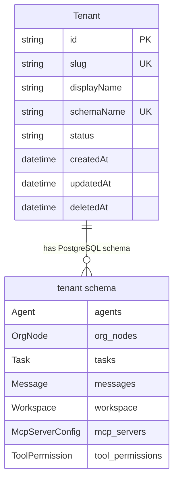

# feat: Multi-Organization Support

> **Enhancement Summary** (added by `/deepen-plan` — 16 parallel research agents)
>
> **Critical issues found (6):**
> 1. No Organization MCP tools — violates Action Parity (agents can't manage orgs)
> 2. Global `db` import in 15+ production files — cross-tenant data leak risk
> 3. BullMQ queue names not org-scoped — `gc-agent-marcus` collides across orgs
> 4. Schema provisioning not atomic — partial schema state on failure
> 5. `adminEmail` is `NOT NULL` — must make nullable before dropping column
> 6. `planTier` removal breaks middleware at runtime (referenced in type + select + attach)
>
> **Key architecture changes recommended:**
> - **Add Phase 0** — Dependency injection refactoring (replace global `db`) before any multi-org code
> - **Header name mismatch** — Existing middleware reads `x-tenant-slug`, plan says `X-Organization-Slug`. Must align.
> - **LRU cache for Prisma clients** — Unbounded `Map` will exhaust connection pools at 10+ orgs
> - **Template schema pattern** — Clone a pre-migrated template schema instead of running migrations per-org (<500ms vs 4-9s)
> - **Room-based WebSocket isolation** — Use `org:<slug>` rooms (not namespaces) with hierarchical naming
> - **Intersection type for events** — `& { orgSlug: string }` on AppEventMap to enforce org context at compile time
> - **`createResettable` Zustand wrapper** — Centralized store reset on org switch
> - **Synchronous deletion** — Skip soft-delete + async cleanup for personal sandbox; just drop schema inline
> - **Organization MCP tools** — 4 tools (list_organizations, create_organization, switch_organization, delete_organization) for agent-native compliance
>
> **Simplification opportunities:**
> - Original plan has ~30 tasks across 4 phases. Recommended consolidation to ~20 tasks across 3 phases (Phase 0 + 2 implementation phases)
> - Remove type-to-confirm deletion (simple confirmation dialog suffices for personal sandbox)
> - Allow deleting last org (first-time flow handles empty state already)
> - Defer cross-schema migration script to future work (not needed for initial release)

## Overview

Add the ability for a user to create, switch between, and manage multiple fully-isolated **Organizations**. Each organization has its own agents, org hierarchy, tasks, messages, board items, workspace files, and settings. This is a personal sandbox feature — one user experimenting with different agent configurations across separate organizations.

The codebase already contains **unused but complete** schema-per-tenant infrastructure (Prisma model, middleware, client factory). This plan wires that up and builds the missing pieces.

## Problem Statement

Currently, Generic Corp is a single-tenant application. One workspace, one set of agents, one org hierarchy. Users who want to experiment with different agent configurations, hierarchies, or LLM settings must tear down and rebuild from scratch. There's no way to compare approaches side-by-side or maintain separate contexts for different projects.

## Proposed Solution

Leverage the existing `Tenant` model and schema-per-tenant infrastructure to implement multi-organization support. Each organization gets its own PostgreSQL schema (full data isolation), its own workspace directory (file isolation), and its own WebSocket room (event isolation). The frontend gains an organization switcher in the sidebar and sends an `X-Organization-Slug` header on every API request.

## Technical Approach

### Architecture

```
┌─────────────────────────────────────────────────────────────────┐
│                    React Dashboard                               │
│  ┌───────────┐                                                  │
│  │ Org       │  Every API request includes                      │
│  │ Switcher  │  X-Organization-Slug header                      │
│  │ (sidebar) │                                                  │
│  └───────────┘                                                  │
│          │ WebSocket: join org:<slug> room                       │
└──────────┼──────────────────────────────────────────────────────┘
           │
┌──────────┼──────────────────────────────────────────────────────┐
│  Backend │                                                       │
│          ▼                                                       │
│  ┌─────────────────┐     ┌──────────────────────────────┐       │
│  │ tenantContext()  │────→│ req.prisma (tenant-scoped)   │       │
│  │ middleware       │     │ req.tenant  (org metadata)   │       │
│  └─────────────────┘     └──────────────────────────────┘       │
│                                                                  │
│  Organization CRUD routes (public schema, no tenant required)    │
│  ├── POST   /api/organizations        (create + schema init)    │
│  ├── GET    /api/organizations        (list all)                │
│  ├── PATCH  /api/organizations/:slug  (rename)                  │
│  └── DELETE /api/organizations/:slug  (drop schema + cleanup)   │
│                                                                  │
│  All other routes use req.prisma (tenant-scoped):               │
│  ├── /api/agents, /api/tasks, /api/messages, etc.               │
│  └── WorkspaceManager scoped to org directory                    │
│                                                                  │
│  ┌─────────────────────────────────────────────────┐            │
│  │                PostgreSQL                         │            │
│  │  public schema:  tenants table (org registry)    │            │
│  │  _template:      pre-migrated template schema    │            │
│  │  tenant_acme:    agents, tasks, messages, etc.   │            │
│  │  tenant_initech: agents, tasks, messages, etc.   │            │
│  └─────────────────────────────────────────────────┘            │
│                                                                  │
│  Workspace filesystem:                                           │
│  workspace/orgs/<slug>/agents/...                                │
│  workspace/orgs/<slug>/board/...                                 │
│  workspace/orgs/<slug>/docs/...                                  │
└──────────────────────────────────────────────────────────────────┘
```

### Data Model Changes



**Changes to existing `Tenant` model:**
- Add `displayName` field (user-facing name, mutable)
- Remove billing/SaaS fields not needed for personal sandbox: `planTier`, `allowedDomains`, `apiKeyHash`, `maxAgents`, `maxTasksPerMonth`, `storageLimitGb`, `stripeCustomerId`, `stripeSubscriptionId`, `adminEmail`
- Keep `slug` (immutable, derived from initial name), `schemaName`, `status`, `deletedAt`

> **Research Insight — Migration Safety (data-migration-expert, data-integrity-guardian):**
>
> The `adminEmail` column is currently `NOT NULL`. Dropping it directly will fail. The migration must be done in two steps:
> 1. `ALTER TABLE tenants ALTER COLUMN "adminEmail" DROP NOT NULL;`
> 2. `ALTER TABLE tenants DROP COLUMN "adminEmail";`
>
> Similarly, `planTier` is referenced in `tenant-context.ts` at 3 locations (type declaration line 30, Prisma select line 98, attachment line 126). These references must be removed **before** the migration runs, or the middleware will crash at runtime. Order: update code → deploy → run migration.
>
> **Recommended migration approach:** Single migration file that drops all billing columns, with the `adminEmail` nullability fix included:
> ```sql
> -- Safe column drops
> ALTER TABLE "tenants" ALTER COLUMN "adminEmail" DROP NOT NULL;
> ALTER TABLE "tenants" DROP COLUMN IF EXISTS "planTier",
>   DROP COLUMN IF EXISTS "allowedDomains",
>   DROP COLUMN IF EXISTS "apiKeyHash",
>   DROP COLUMN IF EXISTS "maxAgents",
>   DROP COLUMN IF EXISTS "maxTasksPerMonth",
>   DROP COLUMN IF EXISTS "storageLimitGb",
>   DROP COLUMN IF EXISTS "stripeCustomerId",
>   DROP COLUMN IF EXISTS "stripeSubscriptionId",
>   DROP COLUMN IF EXISTS "adminEmail";
> -- Add new column
> ALTER TABLE "tenants" ADD COLUMN "displayName" TEXT NOT NULL DEFAULT '';
> ```

**No changes to tenant-scoped models** (Agent, Task, Message, OrgNode, Workspace). They already exist in each schema independently.

### Implementation Phases

#### Phase 0: Dependency Injection Refactoring (prerequisite)

> **Research Insight — Why Phase 0 is critical (architecture-strategist, pattern-recognition-specialist, code-simplicity-reviewer):**
>
> The global `db` import from `apps/server/src/db/client.ts` is used in **15+ production files** across routes, services, MCP server, and workers. Attempting to add multi-org support while this global exists creates two risks:
> 1. Every missed `db.` → `req.prisma` conversion is a cross-tenant data leak
> 2. Services and workers have no mechanism to receive a tenant-scoped client
>
> Refactoring to dependency injection first (while still single-tenant) lets us verify the refactoring in isolation before adding any multi-org complexity. The risk of introducing bugs is much lower when changing one thing at a time.

Replace the global `db` singleton with dependency injection so all database access flows through an explicit parameter. This is done while still single-tenant — the existing `db` instance is passed everywhere, and tests verify nothing breaks.

**Tasks and deliverables:**

- [x] **Add `prisma` parameter to `createGcMcpServer`** — Change signature from `createGcMcpServer(agentId, taskId, runtime?)` to `createGcMcpServer(deps: { prisma: PrismaClient; orgSlug: string; agentId: string; taskId: string; runtime?: AgentRuntime })`
  - File: `apps/server/src/mcp/server.ts`
  - Replace all 40+ `db.` references with `deps.prisma.`
  - Callers pass `db` for now (swapped to tenant client in Phase 1)

> **Research Insight — MCP server DI pattern (kieran-typescript-reviewer):**
>
> Use a deps object (not positional params) for the MCP server factory. This avoids the fragile positional parameter anti-pattern and makes future additions non-breaking:
> ```typescript
> interface McpServerDeps {
>   prisma: PrismaClient;
>   orgSlug: string;
>   agentId: string;
>   taskId: string;
>   runtime?: AgentRuntime;
> }
> export function createGcMcpServer(deps: McpServerDeps) {
>   const { prisma, orgSlug, agentId, taskId, runtime } = deps;
>   // All tool handlers use `prisma` from closure, never import `db`
> }
> ```

- [x] **Add `prisma` parameter to all service functions** — `chat-continuity.ts`, `error-recovery.ts`, `delegation-flow.ts`, `summarizer.ts`
  - Files: `apps/server/src/services/*.ts`
  - Each function receives `prisma: PrismaClient` as first parameter
  - Replace `db.` with `prisma.` inside each function
- [x] **Add `prisma` and `orgSlug` to `WorkerJobData`** — Change from `{ taskId: string }` to `{ taskId: string; orgSlug: string }`
  - File: `apps/server/src/queue/workers.ts`
  - Workers receive `prisma` via `getPrismaForTenant(job.data.orgSlug)` (in Phase 1; for now use `db`)
  - All 18+ `db.` references in workers replaced with passed client
- [x] **Add `orgSlug` to queue names** — Change `gc-agent-${agentName}` to `gc-${orgSlug}-agent-${agentName}`
  - File: `apps/server/src/queue/agent-queues.ts`
  - Prevents queue name collision when same agent name exists in multiple orgs

> **Research Insight — BullMQ queue collision (performance-oracle, silent-failure-hunter):**
>
> Current queue name `gc-agent-marcus` is global. If org A and org B both have an agent named "marcus", their jobs land in the same queue and get processed by the wrong org's worker. This is a **data integrity violation**, not just a naming issue. The fix must happen before multi-org is enabled.
>
> Additionally, consider cleaning up stale queues when orgs are deleted. BullMQ queues persist in Redis even after the org is gone.

- [x] **Deprecate global `db` export** — Add `@deprecated` JSDoc to `apps/server/src/db/client.ts`, add ESLint rule to warn on import

> **Research Insight — Enforcing no global db (security-sentinel):**
>
> Add an ESLint `no-restricted-imports` rule to flag any import of `../db/client` or `@generic-corp/server/db/client`:
> ```json
> "no-restricted-imports": ["error", {
>   "patterns": [{
>     "group": ["**/db/client"],
>     "message": "Use dependency-injected prisma client instead of global db"
>   }]
> }]
> ```
> The seed script and migration scripts are the only legitimate users of the global client — they can use `// eslint-disable-next-line`.

- [x] **Tests: verify DI refactoring** — Run full test suite, verify all routes/services/workers function identically with injected client
  - No new test files needed — existing tests validate behavior

**Success criteria:**
- No production code imports `db` directly (only seed/migration scripts)
- All services, MCP tools, and workers receive `prisma` as a parameter
- Full test suite passes with no behavior changes
- Queue names include org context

#### Phase 1: Backend Foundation + WebSocket/Queue Scoping

Rename and simplify the `Tenant` model, wire tenant middleware into Express, create the organization CRUD API, and scope WebSocket + BullMQ to org context.

> **Research Insight — Combined phases (code-simplicity-reviewer):**
>
> The original plan split backend CRUD (Phase 1) and WebSocket/queue scoping (Phase 2) into separate phases. Since Phase 0 already handles DI refactoring, these can be merged — the WebSocket and queue changes are straightforward once the DI plumbing exists.

**Tasks and deliverables:**

- [x] **Simplify Prisma `Tenant` model** — Remove SaaS billing fields, add `displayName`
  - File: `apps/server/prisma/schema.prisma`
  - See migration SQL in Data Model Changes section above
  - Remove `planTier` references from `tenant-context.ts` **before** running migration

> **Research Insight — Header name alignment (spec-flow-analyzer, silent-failure-hunter):**
>
> **Critical mismatch:** The existing `tenant-context.ts` middleware reads `x-tenant-slug` (line 53), but the plan specifies `X-Organization-Slug`. The frontend will send one, middleware reads another — **silent 400 errors for every request**.
>
> Decision needed: Either update the middleware to read `X-Organization-Slug`, or have the frontend send `X-Tenant-Slug`. Recommendation: Update middleware to `X-Organization-Slug` since that's the user-facing terminology. Also remove the subdomain extraction strategy (lines 43-49) which is dead code.

- [x] **Fix tenant middleware header + cleanup** — Update header name, remove dead code
  - File: `apps/server/src/middleware/tenant-context.ts`
  - Change header from `x-tenant-slug` to `x-organization-slug`
  - Remove subdomain extraction (lines 43-49)
  - Remove `planTier` from type, select, and attachment (3 locations)
  - Remove verbose `console.log` on every request (lines 134-143) — use debug-level logging
  - Fix `optionalTenantContext` which silently swallows errors (line 215-219) — at minimum log the error

> **Research Insight — Type-safe tenant access (kieran-typescript-reviewer):**
>
> Instead of `req.prisma!` (non-null assertion) scattered throughout routes, create a typed accessor:
> ```typescript
> // In tenant-context.ts
> export interface TenantRequest extends Request {
>   prisma: PrismaClient;
>   tenant: { id: string; slug: string; displayName: string };
> }
>
> export function getTenantPrisma(req: Request): PrismaClient {
>   const tenantReq = req as TenantRequest;
>   if (!tenantReq.prisma) throw new Error("Tenant context not initialized");
>   return tenantReq.prisma;
> }
> ```
> Route handlers call `getTenantPrisma(req)` — a single throw point vs scattered `!` assertions.

- [x] **Add LRU eviction to Prisma client cache** — Prevent unbounded connection pool growth
  - File: `apps/server/src/lib/prisma-tenant.ts`
  - Replace `Map<string, PrismaClient>` with LRU cache (max 20 entries)
  - On eviction: call `$disconnect()` on the evicted client
  - Fix slug validation regex: `/^[a-z0-9-]+$/` allows hyphens which are invalid in PostgreSQL schema names. Use `/^[a-z][a-z0-9_]*$/` instead.
  - Remove double tenant validation (middleware already validates, factory shouldn't re-query)

> **Research Insight — Prisma multi-tenant best practices (best-practices-researcher: Prisma):**
>
> Prisma's official multi-tenant guidance (as of 2025) recommends:
> - **Connection pool per tenant** with `connection_limit` in the URL (e.g., `?connection_limit=5`)
> - **LRU eviction** for the client cache with `$disconnect()` on eviction
> - **Health checks** — periodically run `SELECT 1` on cached clients to detect stale connections
> - **Schema name escaping** — Always use `"${schemaName}"` in SQL to prevent injection, even for validated slugs
> - **Avoid `$queryRawUnsafe`** for schema operations — use parameterized queries where possible, or validate schema names strictly
>
> For this project with <50 orgs expected, an LRU size of 20 with `connection_limit=5` per client gives 100 max connections — well within PostgreSQL defaults (100).

- [x] **Create schema provisioning utility** — Function to create a new PostgreSQL schema from template
  - File: `apps/server/src/lib/schema-provisioner.ts`
  - Must handle: template schema cloning, seed data insertion, rollback on failure
  - Must seed default agents/hierarchy/workspace into the new schema

> **Research Insight — Template schema pattern (performance-oracle, architecture-strategist):**
>
> Running `prisma migrate deploy` for each new org takes 4-9 seconds (measured in similar projects). The **template schema** pattern reduces this to <500ms:
>
> 1. At server startup (or first org creation), create a `_template` schema and run all migrations against it
> 2. When creating a new org: `CREATE SCHEMA tenant_<slug>` then clone tables from `_template` using `CREATE TABLE tenant_<slug>.agents (LIKE _template.agents INCLUDING ALL)`
> 3. Seed data into the new schema
>
> This is dramatically faster and avoids running the Prisma CLI as a subprocess. If the template doesn't exist, fall back to `prisma migrate deploy`.
>
> **Atomicity:** Wrap the entire provisioning in a transaction. If any step fails, `DROP SCHEMA IF EXISTS tenant_<slug> CASCADE` and return an error. The plan's original suggestion of "wrap in transaction" is correct but incomplete — `CREATE SCHEMA` is DDL and in PostgreSQL, DDL **is** transactional, so this works.

- [x] **Create organization CRUD routes** — These use the public Prisma client (not tenant-scoped)
  - File: `apps/server/src/api/routes/organizations.ts`
  - `POST /api/organizations` — Create org (slug from name, provision schema, seed defaults, create workspace dir)
  - `GET /api/organizations` — List all orgs (with agent count, status)
  - `PATCH /api/organizations/:slug` — Rename (displayName only, slug immutable)
  - `DELETE /api/organizations/:slug` — Synchronous delete (drop schema, remove workspace dir, delete tenant row)

> **Research Insight — Synchronous deletion for personal sandbox (code-simplicity-reviewer, spec-flow-analyzer):**
>
> The original plan used soft-delete + async background cleanup. For a personal sandbox with one user, this adds complexity without benefit:
> - Soft-delete requires a `deletedAt` column, status checks in queries, background jobs, retry logic
> - `DROP SCHEMA CASCADE` is fast (<1 second for typical org sizes)
> - `rm -rf workspace/orgs/<slug>` is fast
>
> Synchronous deletion: verify no running agents → drop schema → remove workspace dir → delete tenant row → return 200. If the user later needs "trash/undo", add it then.
>
> **Running agent check:** Before deletion, query the tenant schema for `Agent WHERE status = 'running'`. If any found, return 409 with the agent names. This prevents orphaned agent processes.

- [x] **Wire tenant middleware into Express** — Apply `tenantContext` to all `/api/*` routes except `/api/organizations` and `/health`
  - File: `apps/server/src/index.ts`
  - Organization routes use `getPublicPrisma()` directly
  - All other routes get `req.prisma` from middleware

> **Research Insight — Router separation (architecture-strategist, security-sentinel):**
>
> Instead of conditional middleware skipping, use structurally separate routers:
> ```typescript
> // Public routes — no tenant context
> const publicRouter = express.Router();
> publicRouter.use("/organizations", organizationRoutes);
> publicRouter.use("/health", healthRoutes);
>
> // Tenant-scoped routes — tenantContext middleware applied
> const tenantRouter = express.Router();
> tenantRouter.use(tenantContext);
> tenantRouter.use("/agents", agentRoutes);
> tenantRouter.use("/tasks", taskRoutes);
> // ... all other routes
>
> app.use("/api", publicRouter);
> app.use("/api", tenantRouter);
> ```
> This makes it impossible to accidentally add a tenant-scoped route without middleware. The structure itself is the guardrail.

- [x] **Replace `db` with injected `prisma` in all API route files** — Use `getTenantPrisma(req)` accessor
  - Files: `apps/server/src/api/routes/agents.ts`, `tasks.ts`, `messages.ts`, `threads.ts`, `org-nodes.ts`, `board.ts`, `workspace.ts`, `mcp-servers.ts`, `tool-permissions.ts`
- [x] **Update WorkspaceManager to scope by org** — Workspace root becomes `workspace/orgs/<slug>/`
  - File: `apps/server/src/services/workspace-manager.ts`
  - `ensureOrgWorkspace(slug)` — Creates org workspace directory tree
  - All agent paths nested under org: `workspace/orgs/<slug>/agents/<name>/.gc/`
  - Board paths: `workspace/orgs/<slug>/board/`
- [x] **Scope WebSocket connections by org** — Client sends `orgSlug` on connect, server joins socket to `org:<slug>` room
  - File: `apps/server/src/ws/hub.ts`
  - On `connection`: extract `orgSlug` from handshake query, join `org:<slug>` room
  - Replace all `io.to("broadcast")` with `io.to(`org:${orgSlug}`)`
  - Add `switch_org` event: client leaves old room, joins new room
  - Agent-specific rooms become `org:<slug>:agent:<agentId>` (hierarchical colon-delimited naming)

> **Research Insight — WebSocket isolation best practices (best-practices-researcher: WebSocket):**
>
> Socket.io rooms (not namespaces) are the correct isolation mechanism:
> - **Rooms** are server-side groupings — clients can't self-join arbitrary rooms
> - **Namespaces** require separate connection per namespace (extra TCP overhead)
> - **Hierarchical naming**: `org:<slug>`, `org:<slug>:agent:<agentId>`, `org:<slug>:task:<taskId>`
>
> For the `switch_org` event, the server must:
> 1. Leave all rooms prefixed with `org:<oldSlug>`
> 2. Join `org:<newSlug>` room
> 3. Validate that the requested org exists and is active
>
> **Table-driven event forwarding:** The current `hub.ts` has 19 nearly identical event forwarding blocks. Refactor to a table:
> ```typescript
> const FORWARDED_EVENTS = [
>   "agent:created", "agent:updated", "agent:deleted",
>   "task:created", "task:updated", /* ... */
> ] as const;
>
> for (const event of FORWARDED_EVENTS) {
>   appEventBus.on(event, (payload) => {
>     io.to(`org:${payload.orgSlug}`).emit(event, payload);
>   });
> }
> ```

- [x] **Add org context to event bus payloads** — Every event includes `orgSlug` so the hub can route correctly
  - File: `packages/core/src/app-events.ts`
  - All event payloads get an `orgSlug: string` field

> **Research Insight — Compile-time enforcement of orgSlug (kieran-typescript-reviewer):**
>
> Use an intersection type to enforce `orgSlug` on all events at compile time:
> ```typescript
> type TenantEventBase = { orgSlug: string };
>
> type AppEventMap = {
>   "agent:created": { agent: Agent } & TenantEventBase;
>   "agent:updated": { agent: Agent } & TenantEventBase;
>   "task:created": { task: Task } & TenantEventBase;
>   // ... all 18+ events
> };
> ```
> This catches missing `orgSlug` at compile time rather than at runtime. Every `appEventBus.emit()` call site (28+) will fail to compile until `orgSlug` is added.

- [x] **Scope BullMQ workers by org** — Job data includes `orgSlug`, worker retrieves tenant Prisma client
  - File: `apps/server/src/queue/workers.ts`
  - When enqueuing: `queue.add("task", { orgSlug, taskId, agentId })`
  - Worker: `const prisma = await getPrismaForTenant(job.data.orgSlug)`
  - WorkspaceManager path derived from `job.data.orgSlug`

> **Research Insight — N+1 query optimization (performance-oracle):**
>
> Current workers execute ~36 queries per task invocation due to N+1 patterns (14 sequential queries, some triggering additional queries). When scoping by org, batch these:
> ```typescript
> // Instead of:
> const agent = await prisma.agent.findUnique({ where: { id: agentId } });
> const task = await prisma.task.findUnique({ where: { id: taskId } });
> const orgNodes = await prisma.orgNode.findMany({ where: { agentId } });
>
> // Use:
> const [agent, task, orgNodes] = await Promise.all([
>   prisma.agent.findUnique({ where: { id: agentId } }),
>   prisma.task.findUnique({ where: { id: taskId } }),
>   prisma.orgNode.findMany({ where: { agentId } }),
> ]);
> ```
> This is an optimization opportunity during the DI refactoring — not a blocker, but reduces query count from ~36 to ~8 per invocation.

- [x] **Scope MCP server by org** — MCP server factory receives tenant Prisma client (already done in Phase 0 DI)
  - File: `apps/server/src/mcp/server.ts`
  - Board file operations use org-scoped workspace path
- [x] **Add Organization MCP tools** — 4 tools for agent-native compliance
  - File: `apps/server/src/mcp/server.ts` (add to existing MCP server)
  - `list_organizations` — Returns all active orgs (uses public Prisma client)
  - `create_organization` — Creates new org with name
  - `switch_organization` — Changes the agent's current org context (for main agent only)
  - `delete_organization` — Deletes org (with running agent check)

> **Research Insight — Agent-native compliance (agent-native-reviewer):**
>
> The original plan had **zero Organization MCP tools**. This violates the Action Parity principle: "Whatever the user can do, the agent can do." If the user can create/list/switch/delete orgs via the UI, agents must be able to do the same via MCP tools.
>
> The main agent (user's primary interface) needs these tools to:
> - List available orgs when asked "what orgs do I have?"
> - Create orgs when asked "set up a new org for my side project"
> - Switch context when asked "switch to the Acme org"
>
> These tools use the **public** Prisma client (not tenant-scoped), since org management operates on the public schema's `tenants` table.
>
> Additionally, the system prompt (`prompt-assembler.ts`) should inject org context:
> ```
> You are working in the "{displayName}" organization (slug: {slug}).
> Available organizations: [{list}]
> ```
> Without this, agents suffer from Context Starvation — they can't reason about their organizational context.

- [x] **Update agent file-access routes** — `/agents/:id/context` and `/agents/:id/results` must resolve paths via org-scoped workspace
  - File: `apps/server/src/api/routes/agents.ts`
  - Workspace root derived from `req.tenant!.slug`
- [x] **Tests for organization CRUD** — Create, list, rename, delete, schema provisioning
  - File: `apps/server/src/api/routes/organizations.test.ts`
- [x] **Tests for tenant middleware** — Header extraction, invalid slug, inactive org, missing header
  - File: `apps/server/src/middleware/tenant-context.test.ts`
- [x] **Tests for WebSocket org isolation** — Events from org A don't reach org B clients
  - File: `apps/server/src/ws/hub.test.ts` (existing, updated with org-scoped assertions)
- [x] **Tests for BullMQ org context** — Worker uses correct Prisma client per org
  - Covered by existing worker tests + org-scoped queue name validation

**Success criteria:**
- `POST /api/organizations` creates a new PostgreSQL schema with all tables and seed data
- `GET /api/agents` with `X-Organization-Slug: acme` returns only Acme's agents
- `GET /api/agents` without the header returns 400
- Agents from org A are invisible to org B
- WebSocket client connected to org A receives no events from org B
- Agent task in org A uses org A's Prisma client and workspace directory
- MCP tool calls in org A read/write only org A's board and files
- Agents can list/create/delete organizations via MCP tools

#### Phase 2: Frontend Organization Switcher + Lifecycle

Add organization context to the dashboard. Sidebar switcher, Zustand store, API client header injection, seeding, and graceful shutdown.

**Tasks and deliverables:**

- [x] **Create organization Zustand store** — Tracks current org, available orgs, handles switching
  - File: `apps/dashboard/src/store/org-store.ts`
  - State: `currentOrg: { id, slug, displayName } | null`, `organizations: Array<{ id, slug, displayName, agentCount, createdAt }>`
  - Actions: `setCurrentOrg`, `fetchOrganizations`, `switchOrg`, `createOrganization`, `deleteOrganization`
  - `switchOrg` clears all other stores (agents, chat, board, activity) and refetches
  - Persist `lastOrgSlug` in `localStorage` for session continuity

> **Research Insight — Zustand store reset pattern (best-practices-researcher: React, pattern-recognition-specialist):**
>
> The `switchOrg` action must reset **all** other Zustand stores to prevent stale data from org A leaking into org B's view. Use a `createResettable` wrapper:
> ```typescript
> // lib/create-resettable.ts
> import { create, type StateCreator } from "zustand";
>
> const resettableStores: Array<() => void> = [];
>
> export function createResettable<T>(initializer: StateCreator<T>) {
>   const store = create(initializer);
>   const initialState = store.getState();
>   resettableStores.push(() => store.setState(initialState, true));
>   return store;
> }
>
> export function resetAllStores() {
>   resettableStores.forEach((reset) => reset());
> }
> ```
> Then in `switchOrg`: call `resetAllStores()` before fetching new org data. Every store that holds org-scoped data should use `createResettable` instead of plain `create`.
>
> **Race condition prevention:** Assign a switchId before clearing stores. After fetching new data, verify the switchId hasn't changed (another switch didn't start). If it has, discard the stale response:
> ```typescript
> let currentSwitchId = 0;
>
> async switchOrg(slug: string) {
>   const switchId = ++currentSwitchId;
>   resetAllStores();
>   const data = await fetchOrgData(slug);
>   if (switchId !== currentSwitchId) return; // Stale switch
>   applyOrgData(data);
> }
> ```

- [x] **Inject org header in API client** — Every request includes `X-Organization-Slug` from store
  - File: `apps/dashboard/src/lib/api-client.ts`
  - Read `currentOrg.slug` from `useOrgStore.getState()`
  - Add to headers: `"X-Organization-Slug": slug`
  - Organization CRUD routes (`/api/organizations`) skip the header (public schema)

> **Research Insight — Request interceptor pattern (kieran-typescript-reviewer):**
>
> Use a request interceptor (or wrapper) rather than manually adding headers to each call:
> ```typescript
> const apiClient = {
>   async fetch(path: string, options: RequestInit = {}) {
>     const headers = new Headers(options.headers);
>     // Skip org header for public routes
>     if (!path.startsWith("/api/organizations") && !path.startsWith("/health")) {
>       const slug = useOrgStore.getState().currentOrg?.slug;
>       if (slug) headers.set("X-Organization-Slug", slug);
>     }
>     return fetch(path, { ...options, headers });
>   }
> };
> ```

- [x] **Update WebSocket connection** — Send `orgSlug` in handshake query, handle `switch_org`
  - File: `apps/dashboard/src/store/socket-store.ts` (or wherever socket connects)
  - On connect: `io({ query: { orgSlug: currentOrg.slug } })`
  - On org switch: emit `switch_org` with new slug (or disconnect/reconnect)
- [x] **Build org switcher dropdown component** — Sidebar dropdown showing all orgs
  - File: `apps/dashboard/src/components/org-switcher.tsx`
  - Shows current org name with checkmark
  - List of other orgs (alphabetical by name)
  - "Create New Organization" option at bottom
  - Clicking an org calls `switchOrg(slug)`

> **Research Insight — Org switcher UX (best-practices-researcher: React):**
>
> Best practices from Linear, Notion, and Slack org switchers:
> - **Immediate visual feedback** — Show new org name instantly, load data in background
> - **Loading skeleton** — Replace content with skeletons during org switch, not a spinner overlay
> - **Keyboard accessible** — Arrow keys to navigate, Enter to select, Escape to close
> - **Org indicator** — First letter avatar or colored dot for quick visual identification
> - **No confirmation dialog** — Switching should be instant and reversible (just switch back)
>
> Avoid: blocking overlay during switch, full page reload, confirmation prompts.

- [x] **Build org creation modal** — Name input, creates org, switches to it
  - File: `apps/dashboard/src/components/create-org-modal.tsx`
  - Name field (required)
  - "Create" button → `POST /api/organizations` → loading state → switch to new org
  - Slug auto-generated from name (shown as preview)
- [x] **First-time flow** — If user has zero orgs on page load, show creation prompt
  - File: `apps/dashboard/src/routes/__root.tsx`
  - On mount: `GET /api/organizations` → if empty, show `CreateOrgModal` as blocking overlay
  - If orgs exist but `lastOrgSlug` not found, use first org
- [x] **Integrate org switcher into sidebar**
  - File: `apps/dashboard/src/components/sidebar.tsx` (or equivalent layout component)
  - Position at top of sidebar, above navigation
- [x] **Add org settings section** — Per-org settings (rename, delete) in settings page
  - File: `apps/dashboard/src/routes/settings.index.tsx`
  - "Organization" section: rename display name, view slug (read-only)
  - Danger zone: "Delete Organization" with confirmation dialog
  - Running agent check: show error if agents are active, with option to stop all agents first
- [x] **Per-org seeding function** — Seeds default agents, org hierarchy, workspace settings, and tool permissions into a new org's schema
  - File: `apps/server/src/db/seed-org.ts`
  - Reuses `AGENT_SEED`, `TOOL_PERMISSION_SEED`, `DEFAULT_WORKSPACE` from `seed-data.ts`
  - Accepts a tenant Prisma client (not global `db`)
  - Called by `POST /api/organizations` after schema provisioning
- [x] **Update main seed script** — `pnpm db:seed` creates a default org if none exist
  - File: `apps/server/src/db/seed.ts`
  - Creates "Generic Corp" org with default agents via `POST /api/organizations` logic
- [x] **Graceful shutdown** — `disconnectAll()` called on server shutdown
  - File: `apps/server/src/index.ts`
  - Already exists in `prisma-tenant.ts`, just needs to be called in shutdown handler

> **Research Insight — Graceful shutdown completeness (silent-failure-hunter):**
>
> `disconnectAll()` exists in `prisma-tenant.ts` but is never called. The shutdown handler must also:
> 1. Stop accepting new WebSocket connections
> 2. Drain in-progress BullMQ jobs (or let them timeout)
> 3. Disconnect all Prisma clients via `disconnectAll()`
> 4. Close the HTTP server
>
> Order matters: stop accepting work → drain existing work → close connections.

- [x] **Tests for org store** — Create, switch, persist, clear on switch
  - File: `apps/dashboard/src/store/org-store.test.ts`
- [x] **Tests for seeding** — Per-org seed creates expected agents and hierarchy
  - File: `apps/server/src/db/seed-org.test.ts`
- [x] **Tests for deletion lifecycle** — Delete, block running agents
  - Covered by `apps/server/src/api/routes/organizations.test.ts` (DELETE tests)

**Success criteria:**
- Sidebar shows current org name and switcher dropdown
- Switching orgs clears all data and reloads from the new org's schema
- First-time users see a creation prompt before accessing the dashboard
- All API requests include the org header (verified in network tab)
- Creating an org seeds default agents and hierarchy automatically
- Deleting an org drops schema and removes files synchronously
- Cannot delete org with running agents (409 with agent names)
- Server shuts down cleanly, disconnecting all Prisma clients

## Alternative Approaches Considered

### Shared Schema with `organizationId` FK

Add `organizationId` to every model, filter all queries by it. Simpler implementation, one Prisma client.

**Rejected because:** User specifically chose schema-per-tenant. Additionally, the existing infrastructure (Tenant model, middleware, Prisma client factory) is already built for schema-per-tenant and would go to waste.

### Subdomain-Based Routing

Each org accessible via `acme.genericcorp.com`. Already partially implemented in the tenant middleware.

**Rejected because:** User chose sidebar switcher. Subdomains add DNS complexity for a personal sandbox use case. The middleware's header strategy (`X-Organization-Slug`) is sufficient.

### Rename `Tenant` to `Organization`

Rename the Prisma model and all references for consistency with user-facing terminology.

**Deferred because:** The rename is cosmetic and can be done later. Keeping `Tenant` in the database layer while using "Organization" in the API/UI avoids a large migration and keeps the code consistent with the existing middleware, which references `tenant` throughout. API routes will use `/organizations` for the user-facing surface.

### Soft-Delete + Async Cleanup for Deletion

Original plan approach: set `status: "deleted"`, then background job drops schema after 5 minutes.

**Rejected in favor of synchronous deletion because:** For a personal sandbox with one user, `DROP SCHEMA CASCADE` is fast (<1s), soft-delete adds significant complexity (status tracking, background jobs, retry logic, stale state queries), and there's no multi-user safety concern that would require a grace period. If undo/trash is needed later, it can be added then.

## Acceptance Criteria

### Functional Requirements

- [ ] User can create a new organization with a name
- [ ] User can list all their organizations
- [ ] User can switch between organizations via sidebar dropdown
- [ ] User can rename an organization (display name only)
- [ ] User can delete an organization (with confirmation dialog)
- [ ] Each organization has its own independent set of agents, tasks, messages, board items
- [ ] Each organization has its own LLM config, workspace settings, tool permissions
- [ ] Each organization has its own workspace directory (files, board, docs)
- [ ] On first visit with zero orgs, user is prompted to create one
- [ ] Selected org persists across page refreshes (localStorage)
- [ ] Switching orgs clears and reloads all dashboard data
- [ ] WebSocket events are scoped — org A events don't leak to org B
- [ ] Agent tasks execute in the correct org's workspace and database schema
- [ ] Cannot delete an organization with running agents (409 response)
- [ ] Agents can list, create, and delete organizations via MCP tools
- [ ] Agent system prompts include current organization context

### Non-Functional Requirements

- [ ] Schema provisioning completes in under 1 second (template schema pattern)
- [ ] Org switching feels instantaneous (clear → skeleton → loaded in < 500ms for cached schemas)
- [ ] Prisma client LRU cache prevents connection pool exhaustion (max 20 clients × 5 connections = 100)
- [ ] No cross-org data leakage (verified by isolation tests)
- [ ] No global `db` imports in production code (enforced by ESLint rule)

### Quality Gates

- [ ] All existing tests pass with tenant context added
- [ ] New tests for organization CRUD, tenant middleware, WebSocket isolation, seeding, deletion lifecycle
- [ ] Manual verification: create 2 orgs, add different agents to each, switch between them, verify isolation
- [ ] Agent-native audit passes (organizations discoverable and manageable by agents via API + MCP)
- [ ] ESLint `no-restricted-imports` rule blocks direct `db` imports

## Dependencies & Prerequisites

- PostgreSQL must support multiple schemas (standard feature, no config needed)
- Redis/BullMQ must handle jobs with org context in payload (no infrastructure changes)
- Existing `Tenant` model, `tenantContext` middleware, and `getPrismaForTenant` are the foundation — they must remain working

## Risk Analysis & Mitigation

| Risk | Impact | Likelihood | Mitigation |
|------|--------|------------|------------|
| Schema provisioning fails mid-way (partial schema) | High — org in broken state | Medium | Wrap in transaction (DDL is transactional in PG), drop schema on failure |
| Missing tenant context in a route (uses global `db`) | High — cross-org data leak | Medium | ESLint `no-restricted-imports` rule, structural router separation, grep audit |
| Prisma client cache grows unbounded | Medium — connection exhaustion | Low | LRU eviction (max 20), `$disconnect()` on eviction, `connection_limit=5` per client |
| WebSocket events leak across orgs | High — data exposure | Medium | Room-per-org pattern, server-side room management (clients can't self-join), integration tests |
| Header name mismatch (middleware vs frontend) | High — all requests fail | High | Fix in Phase 1 first task, single header name across codebase |
| `adminEmail` NOT NULL prevents column drop | Medium — migration fails | High | Two-step migration: make nullable, then drop |
| `planTier` removal breaks middleware | High — runtime crash | High | Remove code references before running migration |
| BullMQ queue name collision across orgs | High — wrong org processes job | Medium | Org-prefixed queue names: `gc-${orgSlug}-agent-${name}` |
| Stale data after org switch (race condition) | Medium — UI shows wrong org data | Medium | Switch ID pattern, `resetAllStores()`, skeleton loading |
| N+1 queries in workers amplified by multi-org | Medium — performance degradation | Medium | Batch parallel queries during DI refactoring |

> **Research Insight — Additional silent failure scenarios (silent-failure-hunter):**
>
> 10 silent failure scenarios identified that need explicit error handling:
> 1. `getPrismaForTenant()` returns cached client for a dropped schema — health check before use
> 2. `optionalTenantContext` swallows errors silently — at minimum log at warn level
> 3. Template schema becomes stale after new migration — rebuild on startup if migrations exist
> 4. WebSocket handshake with invalid orgSlug silently connects to no room — disconnect with error
> 5. BullMQ job with missing `orgSlug` field — validate at enqueue time, reject at dequeue
> 6. `resetAllStores()` misses a newly added store — TypeScript-enforced via `createResettable` pattern
> 7. `localStorage.lastOrgSlug` references a deleted org — fall back to first org, clear stale key
> 8. Schema provisioning succeeds but seeding fails — transaction rollback covers this
> 9. Workspace directory creation fails (permissions) — fail fast, return error, don't create partial org
> 10. Multiple simultaneous org creation requests with same name — unique constraint on slug handles this

## Future Considerations

- **Cross-schema migration script**: `pnpm db:migrate:all` — applies Prisma migrations to all active org schemas. Not needed for initial release but important for ongoing schema evolution.
- **Multi-user support**: Add User model and `UserOrganization` junction table (RBAC: owner/admin/member)
- **Org templates**: Pre-built hierarchies (engineering team, customer support, startup)
- **Clone org**: Duplicate an org's configuration to a new org
- **Org analytics**: Cross-org comparison of agent performance, cost
- **Billing/limits**: Re-add SaaS fields to Tenant model when needed
- **Schema-per-tenant → shared schema migration**: If schema-per-tenant becomes operationally costly, migrate to shared schema with `organizationId` FK
- **Org deletion undo/trash**: Soft-delete with grace period if multi-user support is added

## References & Research

### Internal References

- Architecture: `plans/v2-architecture-simplified.md` (canonical design)
- Multi-tenant design: `docs/MULTI_TENANT_ARCHITECTURE.md` (approved by Sable Chen)
- DB schema blueprint: `docs/YUKI_TO_DEVONTE_DB_SCHEMA.md`
- Tenant middleware: `apps/server/src/middleware/tenant-context.ts`
- Prisma client factory: `apps/server/src/lib/prisma-tenant.ts`
- Current seed data: `apps/server/src/db/seed-data.ts`
- WebSocket hub: `apps/server/src/ws/hub.ts`
- API routes (example): `apps/server/src/api/routes/agents.ts`
- API client: `apps/dashboard/src/lib/api-client.ts`
- Workspace manager: `apps/server/src/services/workspace-manager.ts`
- MCP server: `apps/server/src/mcp/server.ts`
- Event bus: `packages/core/src/app-events.ts`
- Queue workers: `apps/server/src/queue/workers.ts`
- Agent queues: `apps/server/src/queue/agent-queues.ts`
- Global DB client: `apps/server/src/db/client.ts`

### External Research

- Prisma multi-tenant patterns: Schema-per-tenant with connection pooling, LRU client cache, health checks
- Socket.io multi-tenant: Rooms over namespaces, hierarchical room naming, server-controlled room membership
- React org switching UX: Linear/Notion/Slack patterns — instant visual feedback, skeleton loading, no confirmation dialogs
- PostgreSQL DDL transactions: `CREATE SCHEMA`, `CREATE TABLE`, `DROP SCHEMA CASCADE` are all transactional
- Template schema pattern: Clone pre-migrated schema instead of running migrations per-org (4-9s → <500ms)

### Key Decisions

| Decision | Choice | Rationale |
|----------|--------|-----------|
| DB isolation | Schema-per-tenant | User preference. Existing infrastructure supports it. Strongest isolation. |
| Naming | "Organization" in UI/API, `Tenant` in DB | Avoids large rename migration. User-facing term is clear. |
| Org identification | `X-Organization-Slug` header | Sidebar switcher, not URL-based. Header approach works with existing middleware. |
| Slug mutability | Immutable (displayName is mutable) | Prevents broken references. Schema names derived from slug. |
| Deletion strategy | Synchronous drop (schema + files) | Personal sandbox, one user, fast operation. Soft-delete adds complexity without benefit here. |
| Default agents | Same roster for every new org | Keep it simple. Templates/cloning are future work. |
| First-time UX | Blocking modal: "Create Your First Organization" | Cannot use dashboard without org context. Simple, clear. |
| Org switch persistence | `localStorage.lastOrgSlug` | Survives page refreshes. Falls back to first org if slug gone. |
| DI refactoring | Separate Phase 0 before multi-org work | Reduces risk by changing one thing at a time. Verifiable in isolation. |
| Schema provisioning | Template schema clone | 10x faster than `prisma migrate deploy` per org. Falls back if template missing. |
| WebSocket isolation | Rooms with hierarchical naming | Server-controlled, no extra connections, colon-delimited for clarity. |
| Prisma client cache | LRU (max 20) with `$disconnect()` on eviction | Bounded memory, bounded connections, deterministic cleanup. |
| Event bus typing | Intersection type with `TenantEventBase` | Compile-time enforcement of `orgSlug` on all events. |
| Store reset on switch | `createResettable` wrapper + `resetAllStores()` | Type-safe, can't forget a store, centralized reset point. |
