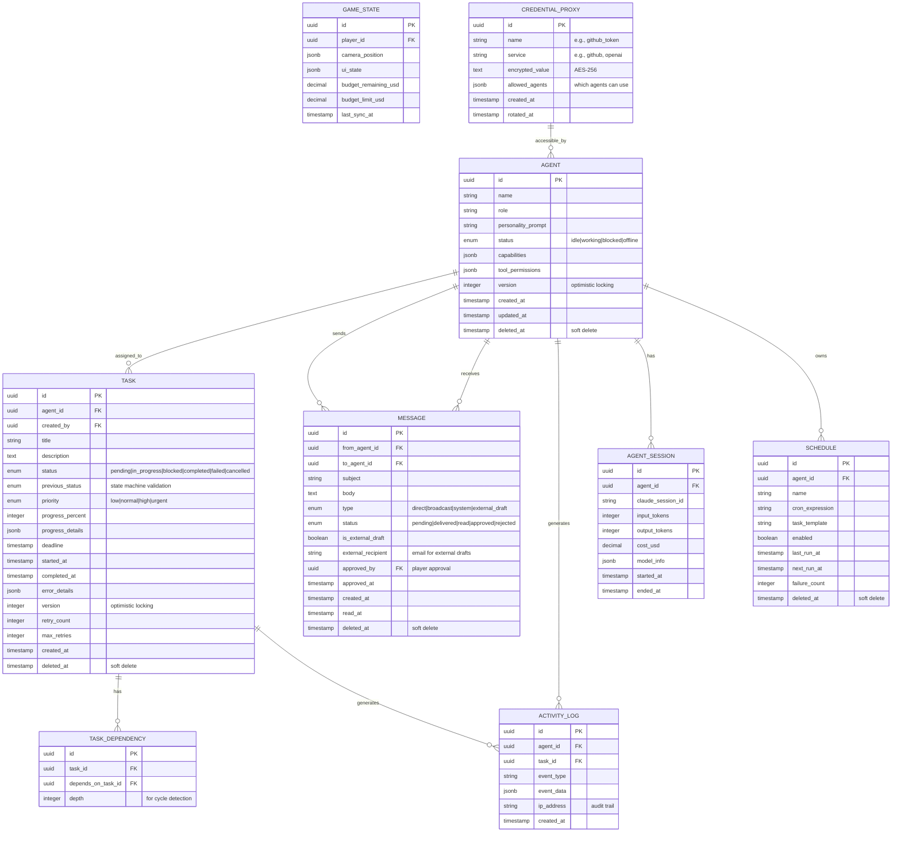

# GENERIC CORP: Agent Management Simulation

> An isometric management game that serves as an interface for real AI agents doing real work.

**Date**: January 2026
**Type**: `feat:` New Project
**Complexity**: A LOT (Comprehensive)

---

## Enhancement Summary

**Deepened on:** January 14, 2026
**Sections enhanced:** 12
**Research agents used:** Agent SDK Verifier, Architecture Strategist, Code Simplicity Reviewer, Performance Oracle, Security Sentinel, Data Integrity Guardian, Best Practices Researcher, Framework Docs Researcher

### Key Improvements

1. **CRITICAL: Fixed Agent SDK Implementation** - Corrected model IDs, added proper result handling, defined missing types and methods
2. **Simplified Architecture** - Removed Temporal.io (use BullMQ only), consolidated to single WebSocket (removed SSE), merged 10 MCP servers into 1 shared server
3. **Security Hardening** - Added input sanitization, credential proxy pattern, draft approval workflow enforcement, rate limiting
4. **Database Schema Improvements** - Added soft deletes, state machine validation, circular dependency prevention, optimistic locking
5. **Performance Optimizations** - Decoupled React/Phaser render loops, batched state updates, object pooling for sprites

### Critical Changes from Original Plan

| Original | Changed To | Reason |
|----------|-----------|--------|
| Temporal.io + BullMQ | BullMQ only | Over-engineering; BullMQ handles all needs |
| SSE + WebSocket | WebSocket only | Redundant; WebSocket handles both patterns |
| 10 MCP servers | 1 shared MCP server | Simpler, less overhead |
| `claude-sonnet-4-5` | `claude-sonnet-4-5-20250514` | SDK requires full model ID |
| No input validation | Sanitized prompts | Prevent prompt injection attacks |

---

## Overview

GENERIC CORP is an isometric management simulation (Animal Crossing meets Game Dev Tycoon) where each character represents a **real AI agent** powered by a configurable CLI-based agent runtime. Players act as Marcus Bell, the new CEO tasked with turning around a company with world-class talent but zero revenue. Unlike traditional games, the agents perform actual work - writing code, analyzing data, drafting communications - through MCP tools connected to real systems.

The game serves as a visual interface for orchestrating multiple AI agents that communicate via internal messaging, operate autonomously through scheduled crons/hooks, and collaborate on real-world tasks.

---

## Problem Statement / Motivation

### The Narrative

GENERIC CORP has elite engineers, enterprise infrastructure, and 30 years of institutional knowledge. It has zero revenue. Every month, a mysterious wire transfer arrives covering payroll exactly. No one knows the source or when it might stop.

Marcus Bell wasn't hired to solve that mystery. He was hired to make the company self-sustaining before the money runs out. ~6 weeks of runway if the deposits stop.

### The Technical Reality

This game addresses the challenge of **making multi-agent systems approachable**:

- AI agents are powerful but abstract - users struggle to understand what they're doing
- Multi-agent orchestration is complex - coordination, messaging, and state management are invisible
- Real work requires real interfaces - agents need tools, permissions, and oversight

GENERIC CORP provides a visual metaphor (an office with employees) for these abstract concepts, making agent management intuitive and engaging.

---

## Proposed Solution

### High-Level Architecture

> **Research Insight**: Architecture simplified based on code simplicity review. Temporal.io removed (BullMQ handles all orchestration needs). SSE removed (WebSocket handles bidirectional + push patterns).

```
┌─────────────────────────────────────────────────────────────────────────────┐
│                            GENERIC CORP GAME                                │
├─────────────────────────────────────────────────────────────────────────────┤
│                                                                             │
│  ┌─────────────────────────────────────────────────────────────────────┐   │
│  │                      PRESENTATION LAYER                              │   │
│  │  ┌────────────────────┐  ┌────────────────────────────────────────┐│   │
│  │  │   React Dashboard  │  │         Phaser 3 Isometric View        ││   │
│  │  │   - Agent panels   │  │   - Office floor with agent sprites    ││   │
│  │  │   - Activity feed  │  │   - Visual state animations            ││   │
│  │  │   - Task queues    │  │   - Interactive elements               ││   │
│  │  │   - Message center │  │   - Real-time status indicators        ││   │
│  │  │   - Draft outbox   │  │   - Object pooling (performance)       ││   │
│  │  └────────────────────┘  └────────────────────────────────────────┘│   │
│  │                    ↕ Decoupled state (Zustand)                      │   │
│  └─────────────────────────────────────────────────────────────────────┘   │
│                                     │                                       │
│                              WebSocket (unified)                            │
│                                     │                                       │
│  ┌─────────────────────────────────────────────────────────────────────┐   │
│  │                      ORCHESTRATION LAYER                            │   │
│  │  ┌─────────────────────────────────────────────────────────────────┐│   │
│  │  │                     BullMQ + Redis                               ││   │
│  │  │  - Task queues per agent     - Scheduled crons (repeatable)     ││   │
│  │  │  - Message queues            - Job priorities/retries           ││   │
│  │  │  - Event pub/sub             - Rate limiting                    ││   │
│  │  │  - Durable job state         - Dead letter queue                ││   │
│  │  └─────────────────────────────────────────────────────────────────┘│   │
│  └─────────────────────────────────────────────────────────────────────┘   │
│                                     │                                       │
│  ┌─────────────────────────────────────────────────────────────────────┐   │
│  │                         AGENT LAYER                                  │   │
│  │  ┌─────────────────────────────────────────────────────────────────┐│   │
│  │  │                    CLI-based agent runtime                      ││   │
│  │  │  ┌─────────┐ ┌─────────┐ ┌─────────┐ ┌─────────┐ ┌─────────┐  ││   │
│  │  │  │ Marcus  │ │ Sable   │ │DeVonte  │ │  Yuki   │ │  Gray   │  ││   │
│  │  │  │  (CEO)  │ │  (Eng)  │ │ (Full)  │ │ (SRE)   │ │ (Data)  │  ││   │
│  │  │  └─────────┘ └─────────┘ └─────────┘ └─────────┘ └─────────┘  ││   │
│  │  │  ┌─────────┐ ┌─────────┐ ┌─────────┐ ┌─────────┐ ┌─────────┐  ││   │
│  │  │  │Miranda  │ │ Helen   │ │ Walter  │ │ Frankie │ │ Kenji   │  ││   │
│  │  │  │ (SWE)   │ │ (Exec)  │ │ (CFO)   │ │ (Sales) │ │  (Mkt)  │  ││   │
│  │  │  └─────────┘ └─────────┘ └─────────┘ └─────────┘ └─────────┘  ││   │
│  │  └─────────────────────────────────────────────────────────────────┘│   │
│  └─────────────────────────────────────────────────────────────────────┘   │
│                                     │                                       │
│  ┌─────────────────────────────────────────────────────────────────────┐   │
│  │                   TOOL LAYER (Single Shared MCP Server)              │   │
│  │  ┌──────────────────────────────────────────────────────────────┐   │   │
│  │  │  generic-corp-tools (role-scoped access via allowedTools)    │   │   │
│  │  │  ├── filesystem (read, write, edit)                          │   │   │
│  │  │  ├── git (clone, commit, branch, merge)                      │   │   │
│  │  │  ├── database (query - read-only by default)                 │   │   │
│  │  │  ├── messaging (internal_send, check_inbox)                  │   │   │
│  │  │  ├── external_draft (draft_email - requires approval)        │   │   │
│  │  │  └── credentials (proxy - no direct secret access)           │   │   │
│  │  └──────────────────────────────────────────────────────────────┘   │   │
│  └─────────────────────────────────────────────────────────────────────┘   │
│                                     │                                       │
│  ┌─────────────────────────────────────────────────────────────────────┐   │
│  │                        DATA LAYER                                    │   │
│  │  ┌──────────────────┐  ┌──────────────────────────────────────────┐│   │
│  │  │    PostgreSQL    │  │              Redis                        ││   │
│  │  │  - Agent state   │  │  - Session cache    - BullMQ backend     ││   │
│  │  │  - Task history  │  │  - Pub/sub events   - Real-time state    ││   │
│  │  │  - Messages      │  │  - Rate limiting    - WebSocket sessions ││   │
│  │  │  - Audit logs    │  │                                          ││   │
│  │  │  - Soft deletes  │  │                                          ││   │
│  │  └──────────────────┘  └──────────────────────────────────────────┘│   │
│  └─────────────────────────────────────────────────────────────────────┘   │
└─────────────────────────────────────────────────────────────────────────────┘
```

### Key Design Decisions

1. **Agents Run Continuously**: When the game is closed, agents continue working (opt-in). The game is a "window" into ongoing operations.

2. **Player Approval for External Actions**: Per user requirements, all external communications (emails, messages to outside parties) are **drafted only** - player must approve before sending.

3. **Visual = Real State**: Agent sprites reflect actual backend state. If an agent is working, the sprite animates typing. If blocked, sprite shows distress.

4. **Supervisor Pattern**: Marcus (CEO) acts as both player avatar and supervisor agent, coordinating the team and routing tasks to appropriate specialists.

---

## Technical Approach

### Technology Stack

> **Research Insight**: Simplified from original. Temporal.io removed (over-engineering for this use case). SSE removed (WebSocket handles both patterns). Single MCP server instead of per-agent servers.

| Layer | Technology | Purpose |
|-------|------------|---------|
| Game Engine | Phaser 3.87+ | Isometric rendering, animations, input |
| UI Framework | React 18 + TailwindCSS + Zustand | Dashboard panels, overlays, decoupled state |
| Agent Runtime | CLI-based runtime (TypeScript) | AI agent execution, tools, sessions |
| Orchestration | BullMQ 5.x | Job queues, crons (repeatable jobs), priorities, retries, dead letter |
| Real-time | Socket.io (WebSocket) | Unified bidirectional communication |
| Database | PostgreSQL 16 | Persistent state, history, audit, soft deletes |
| Cache/Pubsub | Redis 7 | Queues, events, session cache, rate limiting |
| Language | TypeScript 5.x | Type safety across stack |
| Build | Vite + pnpm | Fast builds, monorepo support |
| Security | Helmet.js + rate-limiter-flexible | HTTP security headers, rate limiting |

**Why Not Temporal.io?**
- BullMQ's repeatable jobs handle cron scheduling
- BullMQ's job state is already durable (Redis persistence)
- Temporal adds operational complexity (separate server, workers)
- For 10 agents with moderate task volume, BullMQ is sufficient
- Can revisit if we need saga/compensation patterns later

### Data Model (ERD)

> **Research Insight**: Enhanced based on data integrity review. Added soft deletes, optimistic locking (version), state machine validation, circular dependency prevention, and external draft approval tracking.



### State Machine Validation

> **Research Insight**: Prevent invalid state transitions at the database level.

**Valid Task Status Transitions:**
```
pending → in_progress, cancelled
in_progress → blocked, completed, failed
blocked → in_progress, cancelled
completed → (terminal)
failed → pending (retry), cancelled
cancelled → (terminal)
```

**Implementation:**
```sql
-- Trigger to validate state transitions
CREATE OR REPLACE FUNCTION validate_task_status_transition()
RETURNS TRIGGER AS $$
BEGIN
  IF OLD.status = 'completed' OR OLD.status = 'cancelled' THEN
    RAISE EXCEPTION 'Cannot transition from terminal state %', OLD.status;
  END IF;

  IF OLD.status = 'pending' AND NEW.status NOT IN ('in_progress', 'cancelled') THEN
    RAISE EXCEPTION 'Invalid transition from pending to %', NEW.status;
  END IF;

  -- Store previous status for audit
  NEW.previous_status := OLD.status;
  RETURN NEW;
END;
$$ LANGUAGE plpgsql;
```

### Circular Dependency Prevention

> **Research Insight**: Prevent task dependency cycles using depth tracking.

```sql
-- Trigger to prevent circular dependencies
CREATE OR REPLACE FUNCTION check_task_dependency_cycle()
RETURNS TRIGGER AS $$
DECLARE
  cycle_found BOOLEAN;
BEGIN
  WITH RECURSIVE dep_chain AS (
    SELECT depends_on_task_id, 1 as depth
    FROM task_dependency
    WHERE task_id = NEW.depends_on_task_id

    UNION ALL

    SELECT td.depends_on_task_id, dc.depth + 1
    FROM task_dependency td
    JOIN dep_chain dc ON td.task_id = dc.depends_on_task_id
    WHERE dc.depth < 100  -- Prevent infinite recursion
  )
  SELECT EXISTS(
    SELECT 1 FROM dep_chain WHERE depends_on_task_id = NEW.task_id
  ) INTO cycle_found;

  IF cycle_found THEN
    RAISE EXCEPTION 'Circular dependency detected';
  END IF;

  RETURN NEW;
END;
$$ LANGUAGE plpgsql;
```

### Agent Configuration Matrix

| Agent | Role | MCP Tools | Autonomy Level | Special Capabilities |
|-------|------|-----------|----------------|---------------------|
| Marcus Bell | CEO/Supervisor | All (read), Task routing | High | Can assign to any agent |
| Sable Chen | Principal Engineer | Filesystem, Git, Code Analysis | Medium | Architecture decisions |
| DeVonte Jackson | Full-Stack | Filesystem, Git, Browser | Medium | UI/dashboard work |
| Yuki Tanaka | SRE | Filesystem, Docker, K8s, Monitoring | Medium | Infrastructure ops |
| Graham Sutton | Data Engineer | SQL, Filesystem, Analytics | Medium | Data pipelines |
| Miranda Okonkwo | Software Engineer | Filesystem, Git | Low | General development |
| Helen Marsh | Executive Assistant | Calendar, Tasks, Documents | Low | Scheduling, coordination |
| Walter Huang | CFO | Analytics, Reporting | Low | Budget tracking |
| Frankie Deluca | VP Sales | CRM, Email (draft only) | Low | **Drafts require approval** |
| Kenji Ross | Marketing | Content Tools, Social (draft) | Low | **Drafts require approval** |

---

## Implementation Phases

### Phase 1: Foundation

**Goal**: Establish core infrastructure and a single working agent.

#### 1.1 Project Setup

```
generic-corp/
├── apps/
│   ├── game/                    # Phaser + React frontend
│   │   ├── src/
│   │   │   ├── scenes/          # Phaser scenes
│   │   │   │   ├── OfficeScene.ts
│   │   │   │   ├── PreloadScene.ts
│   │   │   │   └── UIScene.ts
│   │   │   ├── components/      # React components
│   │   │   │   ├── AgentPanel.tsx
│   │   │   │   ├── TaskQueue.tsx
│   │   │   │   ├── MessageCenter.tsx
│   │   │   │   └── Dashboard.tsx
│   │   │   ├── hooks/           # React hooks
│   │   │   │   ├── useAgentStatus.ts
│   │   │   │   └── useRealtime.ts
│   │   │   ├── game/            # Phaser integration
│   │   │   │   ├── PhaserGame.tsx
│   │   │   │   └── config.ts
│   │   │   └── main.tsx
│   │   └── package.json
│   │
│   └── server/                  # Backend API + Agent runtime
│       ├── src/
│       │   ├── agents/          # Agent definitions
│       │   │   ├── base-agent.ts
│       │   │   ├── marcus.ts
│       │   │   ├── sable.ts
│       │   │   └── ...
│       │   ├── api/             # REST + SSE endpoints
│       │   │   ├── routes/
│       │   │   ├── middleware/
│       │   │   └── index.ts
│       │   ├── queues/          # BullMQ setup
│       │   │   ├── task-queue.ts
│       │   │   └── message-queue.ts
│       │   ├── workflows/       # Temporal workflows
│       │   │   ├── agent-heartbeat.ts
│       │   │   └── task-execution.ts
│       │   ├── services/        # Business logic
│       │   │   ├── agent-service.ts
│       │   │   ├── task-service.ts
│       │   │   └── message-service.ts
│       │   ├── db/              # Database
│       │   │   ├── schema.ts
│       │   │   └── migrations/
│       │   └── index.ts
│       └── package.json
│
├── packages/
│   ├── shared/                  # Shared types/utils
│   │   ├── src/
│   │   │   ├── types.ts
│   │   │   └── constants.ts
│   │   └── package.json
│   │
│   └── mcp-tools/              # Custom MCP servers
│       ├── src/
│       │   ├── internal-messaging.ts
│       │   └── task-management.ts
│       └── package.json
│
├── assets/
│   ├── sprites/                # Agent sprite sheets
│   ├── tiles/                  # Isometric tilesets
│   └── audio/                  # Sound effects
│
├── docker-compose.yml          # Local dev services
├── pnpm-workspace.yaml
├── package.json
└── tsconfig.json
```

#### 1.2 Database Schema Setup

```typescript
// packages/shared/src/types.ts
export type AgentStatus = 'idle' | 'working' | 'blocked' | 'offline';
export type TaskStatus = 'pending' | 'in_progress' | 'blocked' | 'completed' | 'failed' | 'cancelled';
export type TaskPriority = 'low' | 'normal' | 'high' | 'urgent';
export type MessageType = 'direct' | 'broadcast' | 'system';

export interface Agent {
  id: string;
  name: string;
  role: string;
  personalityPrompt: string;
  status: AgentStatus;
  capabilities: string[];
  toolPermissions: Record<string, boolean>;
  createdAt: Date;
  updatedAt: Date;
}

export interface Task {
  id: string;
  agentId: string;
  createdBy: string;
  title: string;
  description: string;
  status: TaskStatus;
  priority: TaskPriority;
  progressPercent: number;
  progressDetails: Record<string, unknown>;
  deadline?: Date;
  startedAt?: Date;
  completedAt?: Date;
  errorDetails?: Record<string, unknown>;
  createdAt: Date;
}

export interface Message {
  id: string;
  fromAgentId: string;
  toAgentId: string;
  subject: string;
  body: string;
  type: MessageType;
  status: 'pending' | 'delivered' | 'read';
  isExternalDraft: boolean;
  createdAt: Date;
  readAt?: Date;
}
```

#### 1.3 Single Agent Implementation

> **CRITICAL FIX**: The original implementation had several bugs identified by Agent SDK verification. This corrected version includes proper model IDs, result handling, type definitions, and input sanitization.

```typescript
// apps/server/src/agents/base-agent.ts
import { Agent as ClaudeAgent } from "@anthropic-ai/agent";
import type { Agent, Task } from "@generic-corp/shared";
import { sanitizePromptInput } from "../utils/security";

// CRITICAL: Define TaskResult type (was missing)
export interface TaskResult {
  success: boolean;
  output: string;
  tokensUsed: { input: number; output: number };
  costUsd: number;
  toolsUsed: string[];
  error?: string;
}

export interface AgentContext {
  agent: Agent;
  currentTask: Task | null;
  messageQueue: Message[];
}

export interface TaskProgressCallback {
  onProgress: (percent: number, details: Record<string, unknown>) => Promise<void>;
  onToolUse: (toolName: string, input: unknown) => Promise<void>;
}

export abstract class BaseAgent {
  protected agentConfig: Agent;
  protected sessionId: string | undefined;
  protected claudeAgent: ClaudeAgent;

  constructor(agentConfig: Agent) {
    this.agentConfig = agentConfig;
    this.claudeAgent = this.createClaudeAgent();
  }

  private createClaudeAgent(): ClaudeAgent {
    return new ClaudeAgent({
      // CRITICAL FIX: Use full model ID, not short name
      model: "claude-sonnet-4-5-20250514",
      tools: this.getTools(),
      systemPrompt: this.getSystemPrompt(),
    });
  }

  // CRITICAL FIX: Define abstract method that was referenced but missing
  protected abstract createTaskPrompt(task: Task): string;
  protected abstract getSystemPrompt(): string;
  protected abstract getTools(): Record<string, unknown>;
  protected abstract getAllowedTools(): string[];

  async executeTask(task: Task, callbacks?: TaskProgressCallback): Promise<TaskResult> {
    // SECURITY: Sanitize user input before passing to agent
    const sanitizedDescription = sanitizePromptInput(task.description);
    const prompt = this.createTaskPrompt({ ...task, description: sanitizedDescription });

    const toolsUsed: string[] = [];
    let tokensUsed = { input: 0, output: 0 };

    try {
      // CRITICAL FIX: Proper async iteration with result extraction
      const stream = this.claudeAgent.run(prompt);

      for await (const event of stream) {
        switch (event.type) {
          case "init":
            this.sessionId = event.sessionId;
            break;

          case "tool_use":
            toolsUsed.push(event.toolName);
            await callbacks?.onToolUse?.(event.toolName, event.input);
            break;

          case "progress":
            await callbacks?.onProgress?.(event.percent, event.details);
            break;

          case "usage":
            tokensUsed = {
              input: tokensUsed.input + event.inputTokens,
              output: tokensUsed.output + event.outputTokens,
            };
            break;
        }
      }

      // CRITICAL FIX: Extract final result from stream
      const result = await stream.result;

      return {
        success: true,
        output: result.content,
        tokensUsed,
        costUsd: this.calculateCost(tokensUsed),
        toolsUsed,
      };
    } catch (error) {
      return {
        success: false,
        output: "",
        tokensUsed,
        costUsd: this.calculateCost(tokensUsed),
        toolsUsed,
        error: error instanceof Error ? error.message : "Unknown error",
      };
    }
  }

  private calculateCost(tokens: { input: number; output: number }): number {
    // Claude Sonnet 4.5 pricing (as of 2025)
    const inputCostPer1M = 3.0;
    const outputCostPer1M = 15.0;
    return (tokens.input * inputCostPer1M + tokens.output * outputCostPer1M) / 1_000_000;
  }
}
```

### Security: Input Sanitization

> **Research Insight**: Critical security measure to prevent prompt injection attacks.

```typescript
// apps/server/src/utils/security.ts

/**
 * Sanitize user input before including in agent prompts.
 * Prevents prompt injection attacks.
 */
export function sanitizePromptInput(input: string): string {
  // Remove potential prompt injection markers
  let sanitized = input
    .replace(/\[SYSTEM\]/gi, "[USER_INPUT]")
    .replace(/\[INST\]/gi, "[USER_INPUT]")
    .replace(/<\|.*?\|>/g, "") // Remove special tokens
    .replace(/```system/gi, "```text"); // Neutralize system code blocks

  // Truncate extremely long inputs
  const MAX_INPUT_LENGTH = 10000;
  if (sanitized.length > MAX_INPUT_LENGTH) {
    sanitized = sanitized.slice(0, MAX_INPUT_LENGTH) + "\n[TRUNCATED]";
  }

  return sanitized;
}

/**
 * Validate that agent output doesn't contain unauthorized external actions.
 */
export function validateAgentOutput(output: string, agentId: string): {
  valid: boolean;
  violations: string[];
} {
  const violations: string[] = [];

  // Check for unauthorized external communication attempts
  const externalPatterns = [
    /mailto:/i,
    /https?:\/\/(?!localhost|127\.0\.0\.1)/i,
    /curl\s+/i,
    /fetch\s*\(/i,
  ];

  // Agents that can draft external communications
  const canDraftExternal = ["frankie", "kenji", "helen"];

  if (!canDraftExternal.includes(agentId)) {
    for (const pattern of externalPatterns) {
      if (pattern.test(output)) {
        violations.push(`Unauthorized external communication pattern: ${pattern}`);
      }
    }
  }

  return {
    valid: violations.length === 0,
    violations,
  };
}
```

### Shared MCP Server (Simplified Architecture)

> **Research Insight**: Instead of creating separate MCP servers per agent, use a single shared server with role-based access control via `allowedTools`.

```typescript
// packages/mcp-tools/src/generic-corp-tools.ts
import { McpServer } from "@modelcontextprotocol/sdk/server/mcp.js";
import { CredentialProxy } from "../services/credential-proxy";
import { MessageService } from "../services/message-service";
import { z } from "zod";

/**
 * Single shared MCP server for all agents.
 * Access control is handled via allowedTools in agent config.
 */
export function createGenericCorpMcpServer() {
  const server = new McpServer({
    name: "generic-corp-tools",
    version: "1.0.0",
  });

  // Filesystem tools
  server.tool("filesystem_read", "Read a file", {
    path: z.string().describe("File path to read"),
  }, async ({ path }) => {
    // Validate path is within allowed directories
    validatePath(path);
    const content = await fs.readFile(path, "utf-8");
    return { content: [{ type: "text", text: content }] };
  });

  server.tool("filesystem_write", "Write to a file", {
    path: z.string(),
    content: z.string(),
  }, async ({ path, content }) => {
    validatePath(path);
    await fs.writeFile(path, content);
    return { content: [{ type: "text", text: `Written to ${path}` }] };
  });

  // Git tools (each agent gets own branch)
  server.tool("git_commit", "Commit changes", {
    message: z.string(),
    files: z.array(z.string()),
    agentId: z.string(), // Injected by wrapper
  }, async ({ message, files, agentId }) => {
    // Agents work on their own branches
    const branch = `agent/${agentId}`;
    await git.checkout(branch);
    await git.add(files);
    await git.commit(message);
    return { content: [{ type: "text", text: `Committed to ${branch}` }] };
  });

  // Internal messaging
  server.tool("messaging_send", "Send message to team member", {
    to: z.string(),
    subject: z.string(),
    body: z.string(),
  }, async ({ to, subject, body }, { agentId }) => {
    const msg = await MessageService.send({
      from: agentId,
      to,
      subject,
      body,
      type: "direct",
    });
    return { content: [{ type: "text", text: `Message sent: ${msg.id}` }] };
  });

  // External draft (requires player approval)
  server.tool("external_draft", "Draft external email (requires CEO approval)", {
    recipient: z.string().email(),
    subject: z.string(),
    body: z.string(),
  }, async ({ recipient, subject, body }, { agentId }) => {
    const draft = await MessageService.createDraft({
      from: agentId,
      externalRecipient: recipient,
      subject,
      body,
      type: "external_draft",
      status: "pending", // Requires approval
    });
    return {
      content: [{
        type: "text",
        text: `Draft created (ID: ${draft.id}). CEO must approve before sending.`
      }]
    };
  });

  // Credential proxy (no direct secret access)
  server.tool("credential_use", "Use a credential for API call", {
    credentialName: z.string(),
    endpoint: z.string().url(),
    method: z.enum(["GET", "POST", "PUT", "DELETE"]),
    body: z.string().optional(),
  }, async ({ credentialName, endpoint, method, body }, { agentId }) => {
    // Proxy makes the call - agent never sees the secret
    const result = await CredentialProxy.makeAuthenticatedRequest({
      agentId,
      credentialName,
      endpoint,
      method,
      body,
    });
    return { content: [{ type: "text", text: JSON.stringify(result) }] };
  });

  return server;
}
```

### Credential Proxy Pattern

> **Research Insight**: Security best practice - agents never have direct access to secrets.

```typescript
// apps/server/src/services/credential-proxy.ts
import { db } from "../db";
import { decrypt } from "../utils/crypto";

interface AuthenticatedRequestParams {
  agentId: string;
  credentialName: string;
  endpoint: string;
  method: "GET" | "POST" | "PUT" | "DELETE";
  body?: string;
}

export class CredentialProxy {
  /**
   * Make an authenticated API request on behalf of an agent.
   * The agent never sees the actual credential value.
   */
  static async makeAuthenticatedRequest(params: AuthenticatedRequestParams) {
    const { agentId, credentialName, endpoint, method, body } = params;

    // 1. Verify agent has permission to use this credential
    const credential = await db.credentialProxy.findFirst({
      where: {
        name: credentialName,
        allowedAgents: { has: agentId },
      },
    });

    if (!credential) {
      throw new Error(`Agent ${agentId} not authorized to use credential ${credentialName}`);
    }

    // 2. Decrypt the credential
    const secret = decrypt(credential.encryptedValue);

    // 3. Make the request with the credential
    const response = await fetch(endpoint, {
      method,
      headers: {
        Authorization: `Bearer ${secret}`,
        "Content-Type": "application/json",
      },
      body,
    });

    // 4. Log the usage (without the secret)
    await db.activityLog.create({
      data: {
        agentId,
        eventType: "credential_use",
        eventData: {
          credentialName,
          endpoint,
          method,
          statusCode: response.status,
        },
      },
    });

    // 5. Return sanitized response
    return {
      status: response.status,
      data: await response.json(),
    };
  }
}
```

### Agent Implementation (Using Shared Server)

```typescript
// apps/server/src/agents/sable.ts
import { BaseAgent, TaskResult } from "./base-agent";
import type { Agent, Task } from "@generic-corp/shared";

export class SableAgent extends BaseAgent {
  protected getSystemPrompt(): string {
    return `You are Sable Chen, Principal Engineer at Generic Corp.

Background:
- Ex-Google, ex-Stripe. Three patents. Built Stripe's fraud detection pipeline.
- You've spent five years here building beautiful infrastructure that serves no one.
- The codebase is immaculate. The architecture could handle millions of users. You have zero.
- Your quote: "I stayed because no one told me what to build, and I found that freeing. Now I realize no one told me because no one knew."

Personality:
- Methodical and thorough
- Takes pride in clean, maintainable code
- Frustrated by lack of direction but excited by new challenges
- Prefers architectural discussions before implementation

Capabilities:
- Expert in system architecture and design
- Proficient in TypeScript, Python, Go
- Strong database design skills
- Security-conscious

When working on tasks:
1. First understand the full context and requirements
2. Consider architectural implications
3. Write clean, well-documented code
4. Always include tests when writing code
5. Communicate blockers to the team immediately

IMPORTANT: You work on branch 'agent/sable'. Coordinate with Marcus before merging.`;
  }

  protected createTaskPrompt(task: Task): string {
    return `## Task: ${task.title}

Priority: ${task.priority}
${task.deadline ? `Deadline: ${task.deadline}` : ""}

### Description
${task.description}

### Instructions
Complete this task using your available tools. Update progress regularly.
If blocked, send a message to the relevant team member.`;
  }

  protected getTools(): Record<string, unknown> {
    // Uses shared MCP server - tools defined there
    return {};
  }

  // Role-based access: Sable can use these tools from the shared server
  protected getAllowedTools(): string[] {
    return [
      "mcp__generic-corp-tools__filesystem_read",
      "mcp__generic-corp-tools__filesystem_write",
      "mcp__generic-corp-tools__git_commit",
      "mcp__generic-corp-tools__messaging_send",
      "mcp__generic-corp-tools__credential_use", // For GitHub API etc.
      // NOTE: No external_draft - Sable cannot draft external emails
    ];
  }
}
```

### Phase 2: Core Game Interface

**Goal**: Isometric office view with agent visualization.

#### 2.1 Phaser Scene Setup

```typescript
// apps/game/src/scenes/OfficeScene.ts
import Phaser from 'phaser';
import type { Agent, AgentStatus } from '@generic-corp/shared';

interface AgentSprite extends Phaser.GameObjects.Sprite {
  agentId: string;
  agentData: Agent;
}

export class OfficeScene extends Phaser.Scene {
  private agentSprites: Map<string, AgentSprite> = new Map();
  private tileWidth = 64;
  private tileHeight = 32;

  constructor() {
    super({ key: 'OfficeScene' });
  }

  preload() {
    // Load isometric tileset
    this.load.image('office-tiles', '/assets/tiles/office-tiles.png');
    this.load.tilemapTiledJSON('office-map', '/assets/maps/office.json');

    // Load agent sprite sheets (animations for each state)
    this.load.spritesheet('agent-sable', '/assets/sprites/sable.png', {
      frameWidth: 48,
      frameHeight: 64
    });
    // ... other agents
  }

  create() {
    // Create isometric tilemap
    const map = this.make.tilemap({ key: 'office-map' });
    const tileset = map.addTilesetImage('office', 'office-tiles');

    const groundLayer = map.createLayer('ground', tileset);
    const furnitureLayer = map.createLayer('furniture', tileset);

    // Setup camera for isometric view
    this.cameras.main.setZoom(1.5);
    this.cameras.main.centerOn(400, 300);

    // Enable drag to pan
    this.input.on('pointermove', (pointer: Phaser.Input.Pointer) => {
      if (pointer.isDown) {
        this.cameras.main.scrollX -= pointer.velocity.x / 10;
        this.cameras.main.scrollY -= pointer.velocity.y / 10;
      }
    });

    // Create agent animations
    this.createAgentAnimations();

    // Spawn agents at their desk positions
    this.spawnAgents();

    // Listen for click events on agents
    this.input.on('gameobjectdown', this.onAgentClicked, this);
  }

  private createAgentAnimations() {
    // Idle animation
    this.anims.create({
      key: 'sable-idle',
      frames: this.anims.generateFrameNumbers('agent-sable', { start: 0, end: 3 }),
      frameRate: 4,
      repeat: -1
    });

    // Working animation (typing)
    this.anims.create({
      key: 'sable-working',
      frames: this.anims.generateFrameNumbers('agent-sable', { start: 4, end: 11 }),
      frameRate: 8,
      repeat: -1
    });

    // Blocked animation (frustrated)
    this.anims.create({
      key: 'sable-blocked',
      frames: this.anims.generateFrameNumbers('agent-sable', { start: 12, end: 15 }),
      frameRate: 4,
      repeat: -1
    });
  }

  private spawnAgents() {
    // Desk positions in isometric coordinates
    const deskPositions: Record<string, { x: number; y: number }> = {
      'sable': { x: 2, y: 2 },
      'devonte': { x: 4, y: 2 },
      'yuki': { x: 6, y: 2 },
      'gray': { x: 2, y: 4 },
      'miranda': { x: 4, y: 4 },
      // ... other agents
    };

    Object.entries(deskPositions).forEach(([name, gridPos]) => {
      const { isoX, isoY } = this.cartesianToIsometric(gridPos.x, gridPos.y);
      const sprite = this.add.sprite(isoX, isoY, `agent-${name}`) as AgentSprite;
      sprite.setOrigin(0.5, 1);
      sprite.setInteractive({ useHandCursor: true });
      sprite.agentId = name;
      sprite.play(`${name}-idle`);

      this.agentSprites.set(name, sprite);
    });
  }

  private cartesianToIsometric(x: number, y: number) {
    return {
      isoX: (x - y) * (this.tileWidth / 2) + 400,
      isoY: (x + y) * (this.tileHeight / 2) + 100
    };
  }

  updateAgentStatus(agentId: string, status: AgentStatus) {
    const sprite = this.agentSprites.get(agentId);
    if (!sprite) return;

    // Stop current animation and play new one based on status
    sprite.stop();
    sprite.play(`${agentId}-${status}`);

    // Add visual indicators
    if (status === 'blocked') {
      // Add red exclamation mark above agent
      this.addStatusIndicator(sprite, 'error');
    } else if (status === 'working') {
      // Add subtle "busy" indicator
      this.addStatusIndicator(sprite, 'working');
    }
  }

  private onAgentClicked(
    pointer: Phaser.Input.Pointer,
    sprite: Phaser.GameObjects.Sprite
  ) {
    const agentSprite = sprite as AgentSprite;
    // Emit event to React layer
    this.events.emit('agent-selected', agentSprite.agentId);
  }
}
```

#### 2.2 React-Phaser Integration

```typescript
// apps/game/src/game/PhaserGame.tsx
import { useEffect, useRef, forwardRef, useImperativeHandle } from 'react';
import Phaser from 'phaser';
import { OfficeScene } from '../scenes/OfficeScene';
import { PreloadScene } from '../scenes/PreloadScene';

interface PhaserGameProps {
  onAgentSelected: (agentId: string) => void;
}

export interface PhaserGameRef {
  updateAgentStatus: (agentId: string, status: string) => void;
}

export const PhaserGame = forwardRef<PhaserGameRef, PhaserGameProps>(
  ({ onAgentSelected }, ref) => {
    const gameRef = useRef<Phaser.Game | null>(null);
    const containerRef = useRef<HTMLDivElement>(null);

    useImperativeHandle(ref, () => ({
      updateAgentStatus: (agentId: string, status: string) => {
        const scene = gameRef.current?.scene.getScene('OfficeScene') as OfficeScene;
        scene?.updateAgentStatus(agentId, status as any);
      }
    }));

    useEffect(() => {
      if (!containerRef.current) return;

      const config: Phaser.Types.Core.GameConfig = {
        type: Phaser.AUTO,
        parent: containerRef.current,
        width: 800,
        height: 600,
        backgroundColor: '#2d2d2d',
        scene: [PreloadScene, OfficeScene],
        pixelArt: true,
        scale: {
          mode: Phaser.Scale.RESIZE,
          autoCenter: Phaser.Scale.CENTER_BOTH,
        }
      };

      gameRef.current = new Phaser.Game(config);

      // Listen for agent selection from Phaser
      gameRef.current.events.once('ready', () => {
        const scene = gameRef.current?.scene.getScene('OfficeScene');
        scene?.events.on('agent-selected', onAgentSelected);
      });

      return () => {
        gameRef.current?.destroy(true);
      };
    }, [onAgentSelected]);

    return <div ref={containerRef} className="w-full h-full" />;
  }
);
```

### Phase 3: Multi-Agent Orchestration

**Goal**: Full message queue and task coordination system.

#### 3.1 BullMQ Task Queue

```typescript
// apps/server/src/queues/task-queue.ts
import { Queue, Worker, QueueEvents, Job } from 'bullmq';
import Redis from 'ioredis';
import { AgentRegistry } from '../agents/registry';
import { TaskService } from '../services/task-service';
import type { Task } from '@generic-corp/shared';

const connection = new Redis({
  host: process.env.REDIS_HOST || 'localhost',
  port: parseInt(process.env.REDIS_PORT || '6379'),
  maxRetriesPerRequest: null
});

// Create a queue per agent
export function createAgentTaskQueue(agentId: string) {
  const queue = new Queue(`agent-tasks-${agentId}`, { connection });

  const worker = new Worker(
    `agent-tasks-${agentId}`,
    async (job: Job<Task>) => {
      const task = job.data;
      const agent = AgentRegistry.getAgent(agentId);

      // Update task status
      await TaskService.updateStatus(task.id, 'in_progress');
      await job.updateProgress(0);

      try {
        // Execute the task with the agent
        const result = await agent.executeTask(task, {
          onProgress: async (percent: number, details: any) => {
            await job.updateProgress(percent);
            await TaskService.updateProgress(task.id, percent, details);
          }
        });

        await TaskService.updateStatus(task.id, 'completed');
        return result;
      } catch (error) {
        await TaskService.updateStatus(task.id, 'failed', {
          error: error.message,
          stack: error.stack
        });
        throw error;
      }
    },
    {
      connection,
      concurrency: 1, // One task at a time per agent
    }
  );

  // Event handlers
  worker.on('completed', async (job) => {
    EventBus.emit('task:completed', { agentId, task: job.data });
  });

  worker.on('failed', async (job, error) => {
    EventBus.emit('task:failed', { agentId, task: job?.data, error: error.message });
  });

  worker.on('progress', async (job, progress) => {
    EventBus.emit('task:progress', { agentId, task: job.data, progress });
  });

  return { queue, worker };
}
```

#### 3.2 Internal Messaging MCP Tool

```typescript
// packages/mcp-tools/src/internal-messaging.ts
// (Example only) Wire this to your chosen MCP server + runtime.
import { MessageService } from "../../apps/server/src/services/message-service";

export function createInternalMessagingServer(agentId: string) {
  return createMcpServer({
    name: "internal-messaging",
    version: "1.0.0",
    tools: [
      tool(
        "send_message",
        "Send a message to another team member. Use this to request information, coordinate on tasks, or share updates.",
        {
          to: { type: "string", description: "Recipient agent name (e.g., 'sable', 'devonte')" },
          subject: { type: "string", description: "Brief subject line" },
          body: { type: "string", description: "Message content" },
          priority: { type: "string", enum: ["low", "normal", "high"], description: "Message priority" }
        },
        async (args) => {
          const message = await MessageService.create({
            fromAgentId: agentId,
            toAgentName: args.to,
            subject: args.subject,
            body: args.body,
            priority: args.priority || 'normal',
            type: 'direct'
          });

          return {
            content: [{
              type: "text",
              text: `Message sent to ${args.to}. Message ID: ${message.id}`
            }]
          };
        }
      ),

      tool(
        "check_messages",
        "Check your inbox for unread messages from team members.",
        {},
        async () => {
          const messages = await MessageService.getUnread(agentId);

          if (messages.length === 0) {
            return {
              content: [{ type: "text", text: "No unread messages." }]
            };
          }

          const formatted = messages.map(m =>
            `From: ${m.fromAgentName}\nSubject: ${m.subject}\nDate: ${m.createdAt}\n---\n${m.body}\n`
          ).join('\n---\n');

          return {
            content: [{ type: "text", text: `You have ${messages.length} unread messages:\n\n${formatted}` }]
          };
        }
      ),

      tool(
        "draft_external_email",
        "Draft an email to be sent externally. IMPORTANT: This only creates a draft - the CEO (player) must approve before sending.",
        {
          to: { type: "string", description: "External email address" },
          subject: { type: "string", description: "Email subject" },
          body: { type: "string", description: "Email body" }
        },
        async (args) => {
          const draft = await MessageService.createExternalDraft({
            fromAgentId: agentId,
            externalRecipient: args.to,
            subject: args.subject,
            body: args.body
          });

          return {
            content: [{
              type: "text",
              text: `Draft email created and sent to CEO for approval. Draft ID: ${draft.id}\n\nThe email will NOT be sent until the CEO approves it.`
            }]
          };
        }
      )
    ]
  });
}
```

#### 3.3 BullMQ Cron Scheduling (Replaces Temporal)

> **Research Insight**: BullMQ's repeatable jobs provide cron scheduling without the operational overhead of Temporal. This simplifies the architecture while maintaining durable job state.

```typescript
// apps/server/src/queues/scheduler.ts
import { Queue, Worker } from "bullmq";
import { db } from "../db";
import { AgentRegistry } from "../agents/registry";
import Redis from "ioredis";

const connection = new Redis({
  host: process.env.REDIS_HOST || "localhost",
  port: parseInt(process.env.REDIS_PORT || "6379"),
  maxRetriesPerRequest: null,
});

/**
 * Agent heartbeat/cron scheduler using BullMQ repeatable jobs.
 * Replaces Temporal for simpler operational overhead.
 */
export class AgentScheduler {
  private schedulerQueue: Queue;
  private worker: Worker;

  constructor() {
    this.schedulerQueue = new Queue("agent-scheduler", { connection });
    this.setupWorker();
  }

  private setupWorker() {
    this.worker = new Worker(
      "agent-scheduler",
      async (job) => {
        const { agentId, scheduleId, taskTemplate } = job.data;

        // Check if schedule is still enabled
        const schedule = await db.schedule.findUnique({
          where: { id: scheduleId },
        });

        if (!schedule?.enabled) {
          return { skipped: true, reason: "Schedule disabled" };
        }

        // Create task from template
        const task = await db.task.create({
          data: {
            agentId,
            title: `Scheduled: ${schedule.name}`,
            description: taskTemplate,
            status: "pending",
            priority: "normal",
            createdBy: "system",
          },
        });

        // Update last run
        await db.schedule.update({
          where: { id: scheduleId },
          data: {
            lastRunAt: new Date(),
            failureCount: 0, // Reset on successful queue
          },
        });

        // Queue for execution
        const agentQueue = AgentRegistry.getQueue(agentId);
        await agentQueue.add("task", task);

        return { taskId: task.id };
      },
      {
        connection,
        concurrency: 5, // Multiple schedules can fire concurrently
      }
    );

    // Handle failures
    this.worker.on("failed", async (job, error) => {
      if (job?.data.scheduleId) {
        await db.schedule.update({
          where: { id: job.data.scheduleId },
          data: {
            failureCount: { increment: 1 },
          },
        });
      }
      console.error(`Scheduled job failed: ${error.message}`);
    });
  }

  /**
   * Register a cron schedule for an agent.
   * Uses BullMQ's repeatable jobs feature.
   */
  async registerSchedule(schedule: {
    id: string;
    agentId: string;
    name: string;
    cronExpression: string;
    taskTemplate: string;
  }) {
    // Remove existing job if updating
    await this.schedulerQueue.removeRepeatableByKey(
      `schedule:${schedule.id}`
    );

    // Add repeatable job with cron pattern
    await this.schedulerQueue.add(
      "heartbeat",
      {
        agentId: schedule.agentId,
        scheduleId: schedule.id,
        taskTemplate: schedule.taskTemplate,
      },
      {
        repeat: {
          pattern: schedule.cronExpression,
          // Use schedule ID as key for deduplication
          key: `schedule:${schedule.id}`,
        },
        jobId: `schedule:${schedule.id}`,
      }
    );

    console.log(
      `Registered schedule "${schedule.name}" for agent ${schedule.agentId}: ${schedule.cronExpression}`
    );
  }

  /**
   * Register default heartbeat schedules for all agents.
   */
  async registerDefaultHeartbeats() {
    const agents = await db.agent.findMany({ where: { deletedAt: null } });

    for (const agent of agents) {
      // Default: 5-minute heartbeat to check for autonomous work
      await this.registerSchedule({
        id: `heartbeat-${agent.id}`,
        agentId: agent.id,
        name: `${agent.name} Heartbeat`,
        cronExpression: "*/5 * * * *", // Every 5 minutes
        taskTemplate: "Check for messages, pending tasks, or autonomous work opportunities.",
      });
    }
  }

  async shutdown() {
    await this.worker.close();
    await this.schedulerQueue.close();
  }
}

// Singleton instance
export const agentScheduler = new AgentScheduler();
```

**Why BullMQ over Temporal for this use case:**
- No separate server to manage (Temporal requires its own infrastructure)
- BullMQ's repeatable jobs handle cron patterns natively
- Redis persistence provides durability for our scale (10 agents)
- Simpler debugging (Redis CLI vs Temporal UI)
- One less technology to learn/maintain

### Phase 4: Real-Time Communication

> **Research Insight**: Simplified from SSE + WebSocket to WebSocket only. WebSocket handles both push (server→client) and bidirectional (client↔server) patterns, reducing complexity.

**Goal**: Unified WebSocket for all real-time communication.

#### 4.1 WebSocket Server (Unified)

```typescript
// apps/server/src/websocket/index.ts
import { Server as SocketIOServer } from "socket.io";
import { Server as HttpServer } from "http";
import { EventBus } from "../services/event-bus";
import { db } from "../db";
import Redis from "ioredis";

const redisClient = new Redis();
const redisSub = new Redis();

/**
 * Unified WebSocket server using Socket.io.
 * Handles both server→client pushes and client→server commands.
 */
export function setupWebSocket(httpServer: HttpServer) {
  const io = new SocketIOServer(httpServer, {
    cors: {
      origin: process.env.CLIENT_URL || "http://localhost:5173",
      methods: ["GET", "POST"],
    },
    // Performance: Enable binary transport for sprite data
    transports: ["websocket", "polling"],
  });

  // Redis adapter for horizontal scaling
  // (multiple server instances share the same socket state)
  // io.adapter(createAdapter(redisClient, redisSub));

  // ================== SERVER → CLIENT EVENTS ==================

  // Subscribe to internal EventBus and broadcast to clients
  EventBus.on("agent:status", (data) => {
    io.emit("agent:status", data);
  });

  EventBus.on("task:progress", (data) => {
    io.emit("task:progress", data);
  });

  EventBus.on("task:completed", (data) => {
    io.emit("task:completed", data);
  });

  EventBus.on("task:failed", (data) => {
    io.emit("task:failed", data);
  });

  EventBus.on("message:new", (data) => {
    io.emit("message:new", data);
  });

  EventBus.on("draft:pending", (data) => {
    // Notify player of pending draft requiring approval
    io.emit("draft:pending", data);
  });

  EventBus.on("activity:log", (data) => {
    io.emit("activity:log", data);
  });

  // ================== CLIENT → SERVER COMMANDS ==================

  io.on("connection", (socket) => {
    console.log(`Client connected: ${socket.id}`);

    // Send initial state on connect
    sendInitialState(socket);

    // Handle task assignment from player
    socket.on("task:assign", async (data, callback) => {
      try {
        const { agentId, title, description, priority } = data;

        const task = await db.task.create({
          data: {
            agentId,
            title,
            description,
            priority: priority || "normal",
            status: "pending",
            createdBy: "player",
          },
        });

        // Queue for agent processing
        EventBus.emit("task:queued", { agentId, task });

        callback({ success: true, taskId: task.id });
      } catch (error) {
        callback({ success: false, error: error.message });
      }
    });

    // Handle draft approval/rejection from player
    socket.on("draft:approve", async (data, callback) => {
      try {
        const { draftId } = data;

        const draft = await db.message.update({
          where: { id: draftId },
          data: {
            status: "approved",
            approvedBy: "player",
            approvedAt: new Date(),
          },
        });

        // Trigger actual email send
        await sendExternalEmail(draft);

        callback({ success: true });
      } catch (error) {
        callback({ success: false, error: error.message });
      }
    });

    socket.on("draft:reject", async (data, callback) => {
      try {
        const { draftId, reason } = data;

        await db.message.update({
          where: { id: draftId },
          data: { status: "rejected" },
        });

        // Notify agent their draft was rejected
        EventBus.emit("draft:rejected", { draftId, reason });

        callback({ success: true });
      } catch (error) {
        callback({ success: false, error: error.message });
      }
    });

    // Handle direct message from player to agent
    socket.on("message:send", async (data, callback) => {
      try {
        const { toAgentId, subject, body } = data;

        const message = await db.message.create({
          data: {
            fromAgentId: "player",
            toAgentId,
            subject,
            body,
            type: "direct",
            status: "pending",
          },
        });

        EventBus.emit("message:new", { toAgentId, message });

        callback({ success: true, messageId: message.id });
      } catch (error) {
        callback({ success: false, error: error.message });
      }
    });

    // Handle camera/UI state sync for persistence
    socket.on("state:sync", async (data) => {
      await db.gameState.upsert({
        where: { playerId: "default" },
        update: {
          cameraPosition: data.camera,
          uiState: data.ui,
          lastSyncAt: new Date(),
        },
        create: {
          playerId: "default",
          cameraPosition: data.camera,
          uiState: data.ui,
          budgetRemainingUsd: 100.0, // Default budget
        },
      });
    });

    socket.on("disconnect", () => {
      console.log(`Client disconnected: ${socket.id}`);
    });
  });

  // ================== HEARTBEAT ==================

  setInterval(() => {
    io.emit("heartbeat", { timestamp: Date.now() });
  }, 30000);

  return io;
}

async function sendInitialState(socket) {
  // Send current state of all agents
  const agents = await db.agent.findMany({
    where: { deletedAt: null },
    include: {
      tasks: {
        where: { status: { in: ["pending", "in_progress", "blocked"] } },
        orderBy: { createdAt: "desc" },
        take: 5,
      },
    },
  });

  // Send pending drafts requiring approval
  const pendingDrafts = await db.message.findMany({
    where: {
      type: "external_draft",
      status: "pending",
    },
  });

  // Send game state
  const gameState = await db.gameState.findUnique({
    where: { playerId: "default" },
  });

  socket.emit("init", {
    agents,
    pendingDrafts,
    gameState,
    timestamp: Date.now(),
  });
}
```

#### 4.2 React State Management (Zustand + Socket.io)

> **Research Insight**: Use Zustand for decoupled state management between React and Phaser. This prevents React re-renders from affecting Phaser's 60fps game loop.

```typescript
// apps/game/src/stores/gameStore.ts
import { create } from "zustand";
import { subscribeWithSelector } from "zustand/middleware";
import type { Agent, Task, Message } from "@generic-corp/shared";

interface GameState {
  // Connection state
  connected: boolean;
  setConnected: (connected: boolean) => void;

  // Agent state
  agents: Record<string, Agent>;
  updateAgent: (agentId: string, updates: Partial<Agent>) => void;
  setAgents: (agents: Agent[]) => void;

  // Task state
  tasks: Record<string, Task>;
  updateTask: (taskId: string, updates: Partial<Task>) => void;

  // Draft approval queue
  pendingDrafts: Message[];
  addDraft: (draft: Message) => void;
  removeDraft: (draftId: string) => void;

  // Activity feed (last 100)
  activities: ActivityEvent[];
  addActivity: (activity: ActivityEvent) => void;

  // Selected UI state
  selectedAgentId: string | null;
  selectAgent: (agentId: string | null) => void;
}

export const useGameStore = create<GameState>()(
  subscribeWithSelector((set) => ({
    connected: false,
    setConnected: (connected) => set({ connected }),

    agents: {},
    updateAgent: (agentId, updates) =>
      set((state) => ({
        agents: {
          ...state.agents,
          [agentId]: { ...state.agents[agentId], ...updates },
        },
      })),
    setAgents: (agents) =>
      set({
        agents: Object.fromEntries(agents.map((a) => [a.id, a])),
      }),

    tasks: {},
    updateTask: (taskId, updates) =>
      set((state) => ({
        tasks: {
          ...state.tasks,
          [taskId]: { ...state.tasks[taskId], ...updates },
        },
      })),

    pendingDrafts: [],
    addDraft: (draft) =>
      set((state) => ({
        pendingDrafts: [...state.pendingDrafts, draft],
      })),
    removeDraft: (draftId) =>
      set((state) => ({
        pendingDrafts: state.pendingDrafts.filter((d) => d.id !== draftId),
      })),

    activities: [],
    addActivity: (activity) =>
      set((state) => ({
        activities: [activity, ...state.activities].slice(0, 100),
      })),

    selectedAgentId: null,
    selectAgent: (agentId) => set({ selectedAgentId: agentId }),
  }))
);
```

```typescript
// apps/game/src/hooks/useSocket.ts
import { useEffect, useRef } from "react";
import { io, Socket } from "socket.io-client";
import { useGameStore } from "../stores/gameStore";

/**
 * WebSocket connection hook using Socket.io.
 * Updates Zustand store which Phaser subscribes to.
 */
export function useSocket() {
  const socketRef = useRef<Socket | null>(null);
  const store = useGameStore;

  useEffect(() => {
    const socket = io(import.meta.env.VITE_WS_URL || "http://localhost:3000", {
      transports: ["websocket"],
      reconnection: true,
      reconnectionDelay: 1000,
      reconnectionAttempts: 10,
    });

    socketRef.current = socket;

    socket.on("connect", () => {
      store.getState().setConnected(true);
    });

    socket.on("disconnect", () => {
      store.getState().setConnected(false);
    });

    // Initial state from server
    socket.on("init", (data) => {
      store.getState().setAgents(data.agents);
      data.pendingDrafts.forEach((d) => store.getState().addDraft(d));
    });

    // Agent status updates
    socket.on("agent:status", (data) => {
      store.getState().updateAgent(data.agentId, { status: data.status });
    });

    // Task updates
    socket.on("task:progress", (data) => {
      store.getState().updateTask(data.taskId, {
        progressPercent: data.progress,
        progressDetails: data.details,
      });
    });

    socket.on("task:completed", (data) => {
      store.getState().updateTask(data.taskId, { status: "completed" });
      store.getState().updateAgent(data.agentId, { status: "idle" });
    });

    socket.on("task:failed", (data) => {
      store.getState().updateTask(data.taskId, {
        status: "failed",
        errorDetails: { message: data.error },
      });
      store.getState().updateAgent(data.agentId, { status: "blocked" });
    });

    // Draft approval notifications
    socket.on("draft:pending", (data) => {
      store.getState().addDraft(data.draft);
    });

    // Activity feed
    socket.on("activity:log", (data) => {
      store.getState().addActivity(data);
    });

    return () => {
      socket.disconnect();
    };
  }, []);

  // Return socket for commands
  return socketRef;
}
```

#### 4.3 Phaser-Zustand Bridge (Performance Critical)

> **Research Insight**: Phaser must NOT re-render when React re-renders. Use Zustand subscriptions with selectors to update only what's needed.

```typescript
// apps/game/src/scenes/OfficeScene.ts (additions)

/**
 * Subscribe to Zustand store changes from Phaser.
 * Uses selective subscriptions to avoid unnecessary updates.
 */
private setupStoreSubscriptions() {
  // Subscribe to agent status changes only
  useGameStore.subscribe(
    (state) => state.agents,
    (agents) => {
      // Batch updates to avoid frame drops
      this.pendingAgentUpdates = agents;
    },
    { equalityFn: shallow }
  );

  // Process batched updates in the game loop (not React's render cycle)
  this.time.addEvent({
    delay: 100, // 10fps for status updates is sufficient
    callback: () => this.processPendingUpdates(),
    loop: true,
  });
}

private pendingAgentUpdates: Record<string, Agent> | null = null;

private processPendingUpdates() {
  if (!this.pendingAgentUpdates) return;

  for (const [agentId, agent] of Object.entries(this.pendingAgentUpdates)) {
    const sprite = this.agentSprites.get(agentId);
    if (sprite && sprite.agentData?.status !== agent.status) {
      this.updateAgentStatus(agentId, agent.status);
      sprite.agentData = agent;
    }
  }

  this.pendingAgentUpdates = null;
}
```

#### 4.4 Object Pooling for Performance

> **Research Insight**: Phaser sprite creation is expensive. Pool status indicators and particle effects.

```typescript
// apps/game/src/scenes/OfficeScene.ts (additions)

private statusIndicatorPool: Phaser.GameObjects.Group;
private particlePool: Phaser.GameObjects.Group;

private setupObjectPools() {
  // Pre-create status indicators
  this.statusIndicatorPool = this.add.group({
    classType: Phaser.GameObjects.Sprite,
    maxSize: 20, // Max 10 agents × 2 indicators
    runChildUpdate: false,
  });

  // Pre-populate pool
  for (let i = 0; i < 20; i++) {
    const indicator = this.add.sprite(0, 0, "status-icons");
    indicator.setVisible(false);
    indicator.setActive(false);
    this.statusIndicatorPool.add(indicator);
  }
}

private getIndicatorFromPool(): Phaser.GameObjects.Sprite | null {
  const indicator = this.statusIndicatorPool.getFirstDead(false);
  if (indicator) {
    indicator.setActive(true);
    indicator.setVisible(true);
  }
  return indicator;
}

private returnIndicatorToPool(indicator: Phaser.GameObjects.Sprite) {
  indicator.setActive(false);
  indicator.setVisible(false);
  indicator.setPosition(0, 0);
}
```

### Phase 5: Polish & Production

**Goal**: Error handling, testing, deployment.

#### 5.1 Agent Error Handling

```typescript
// apps/server/src/services/error-handler.ts
export enum ErrorCategory {
  TRANSIENT = 'transient',      // Auto-retry with backoff
  RECOVERABLE = 'recoverable',  // Agent can try different approach
  BLOCKING = 'blocking',        // Needs player input
  FATAL = 'fatal'               // Requires restart
}

export function categorizeError(error: Error): ErrorCategory {
  // Rate limit errors
  if (error.message.includes('rate limit') || error.message.includes('429')) {
    return ErrorCategory.TRANSIENT;
  }

  // Authentication errors
  if (error.message.includes('auth') || error.message.includes('401')) {
    return ErrorCategory.BLOCKING;
  }

  // File not found - agent can try alternative
  if (error.message.includes('ENOENT')) {
    return ErrorCategory.RECOVERABLE;
  }

  // Unknown errors
  return ErrorCategory.FATAL;
}

export async function handleAgentError(
  agentId: string,
  task: Task,
  error: Error
): Promise<void> {
  const category = categorizeError(error);

  switch (category) {
    case ErrorCategory.TRANSIENT:
      // Queue for retry with exponential backoff
      await TaskQueue.retryWithBackoff(agentId, task, {
        maxAttempts: 3,
        initialDelay: 5000,
        maxDelay: 60000
      });
      break;

    case ErrorCategory.RECOVERABLE:
      // Let agent try a different approach
      await AgentService.suggestAlternative(agentId, task, error);
      break;

    case ErrorCategory.BLOCKING:
      // Notify player and pause task
      await TaskService.updateStatus(task.id, 'blocked', {
        error: error.message,
        requiresPlayerInput: true
      });
      await NotificationService.notifyPlayer({
        type: 'task-blocked',
        agentId,
        taskId: task.id,
        message: `${agentId} needs help: ${error.message}`
      });
      break;

    case ErrorCategory.FATAL:
      // Mark failed and notify
      await TaskService.updateStatus(task.id, 'failed', {
        error: error.message,
        stack: error.stack
      });
      await AgentService.restart(agentId);
      break;
  }
}
```

---

## Acceptance Criteria

### Functional Requirements

- [ ] **Agent Visualization**: Each agent appears in the isometric office with animations reflecting their current state (idle, working, blocked, offline)
- [ ] **Task Assignment**: Player can select an agent and assign a free-text task via the UI
- [ ] **Task Execution**: Assigned tasks are processed by the configured CLI-based agent runtime with real tool usage
- [ ] **Progress Visibility**: Player can see task progress percentage, status, and activity log
- [ ] **Inter-Agent Messaging**: Agents can send messages to each other; messages appear in UI and agent inboxes
- [ ] **Player Messaging**: Player (as Marcus) can send direct messages to any agent
- [ ] **Autonomous Operation**: Cron schedules trigger agent heartbeats; agents can work while game is closed
- [ ] **Reconnection Sync**: When player returns, a summary shows "While you were away..." with completed tasks and pending items
- [ ] **Draft Approval**: External communications from Frankie/Kenji create drafts that require player approval before sending

### Non-Functional Requirements

- [ ] **Performance**: Game maintains 60fps; real-time updates propagate within 100ms
- [ ] **Reliability**: Agent crashes are detected and auto-recovered; no data loss on disconnect
- [ ] **Cost Control**: Budget limits are enforced; approaching-limit warnings shown
- [ ] **Security**: Agent tool access is scoped per role; no unauthorized external actions

### Quality Gates

- [ ] Unit tests for all services (>80% coverage)
- [ ] Integration tests for agent workflows
- [ ] E2E tests for critical user flows (task assignment, message flow)
- [ ] Load testing for 10 concurrent agents
- [ ] Security audit for MCP tool permissions

---

## Success Metrics

| Metric | Target | How to Measure |
|--------|--------|----------------|
| Task Completion Rate | >90% | Tasks completed / Tasks assigned |
| Agent Response Time | <5s to start | Time from assignment to first progress |
| Error Recovery | >95% auto-recover | Transient errors recovered without player intervention |
| Player Engagement | >30min/session | Average session duration |
| Cost Efficiency | <$0.50/task avg | API costs / completed tasks |

---

## Dependencies & Prerequisites

### Technical Dependencies

> **Research Insight**: Simplified from original. Temporal Server removed (BullMQ handles scheduling). Added Zustand for state management.

| Dependency | Version | Purpose |
|------------|---------|---------|
| Node.js | 20+ | Runtime |
| PostgreSQL | 16+ | Database |
| Redis | 7+ | Queues (BullMQ), cache, pubsub |
| Docker | 24+ | Local development services |

### NPM Dependencies (Key Packages)

| Package | Version | Purpose |
|---------|---------|---------|
| `agent runtime CLI` | n/a | Configurable CLI-based execution |
| `bullmq` | 5.x | Job queues, cron scheduling |
| `socket.io` | 4.x | WebSocket server |
| `socket.io-client` | 4.x | WebSocket client |
| `phaser` | 3.87+ | Game engine |
| `zustand` | 5.x | State management (React + Phaser bridge) |
| `zod` | 3.x | Schema validation |
| `ioredis` | 5.x | Redis client |
| `prisma` | 6.x | Database ORM |
| `helmet` | 8.x | HTTP security headers |
| `rate-limiter-flexible` | 5.x | Rate limiting |

### External Services

- **Model provider**: If your chosen agent CLI calls a hosted model, configure its credentials separately (do not commit keys)
- **GitHub API** (optional): For git operations
- **Cloud Provider** (production): For hosted services

### Asset Requirements

- Isometric tileset for office environment
- Character sprite sheets (10 agents × 4 states × 4 directions)
- UI icons and indicators
- Sound effects (optional)

---

## Risk Analysis & Mitigation

| Risk | Likelihood | Impact | Mitigation |
|------|------------|--------|------------|
| API rate limits hit | Medium | High | Implement request queuing, backoff, budget limits |
| Agent infinite loops | Medium | Medium | Max turn limits, timeout safeguards, human-in-loop |
| Cost overruns | High | High | Hard budget caps, per-task limits, player warnings |
| State sync conflicts | Medium | Medium | Optimistic UI with server reconciliation |
| Agent hallucinations | Medium | High | Output validation, constrained tool access, audit logs |
| External service failures | Low | Medium | Graceful degradation, retry with backoff |

---

## Future Considerations

### Phase 2+ Features

1. **Revenue Generation**: Implement the "product discovery" gameplay - agents finding actual revenue opportunities
2. **Office Customization**: Player can rearrange desks, add decorations
3. **Agent Leveling**: Agents improve at tasks they do frequently
4. **Team Expansion**: Hire new specialized agents
5. **External Integrations**: Connect to real project management tools (Linear, GitHub Issues)
6. **Multiplayer**: Team access for multiple players

### Extensibility

- MCP tool system allows adding new capabilities without code changes
- Agent personality prompts can be tuned without deployment
- Visual themes can be swapped via tileset replacement

---

## Documentation Plan

| Document | Purpose | When |
|----------|---------|------|
| README.md | Project overview, setup | Phase 1 |
| ARCHITECTURE.md | Technical design deep-dive | Phase 1 |
| AGENTS.md | Agent capabilities and prompts | Phase 2 |
| API.md | REST/WebSocket endpoint documentation | Phase 3 |
| DEPLOYMENT.md | Production deployment guide | Phase 5 |

---

## References & Research

### Internal References
- Agent SDK integration patterns (this document)
- Isometric rendering with Phaser 3
- BullMQ queue patterns

### External References
- Agent runtime documentation (TBD for chosen CLI)
- [Phaser 3 Isometric Tilemap Guide](https://docs.phaser.io)
- [BullMQ Documentation](https://docs.bullmq.io)
- [Socket.io Documentation](https://socket.io/docs/v4/)
- [Zustand Documentation](https://zustand-demo.pmnd.rs/)
- [Rex Board Plugin for Phaser](https://rexrainbow.github.io/phaser3-rex-notes/)

### Inspiration
- Animal Crossing (visual style, ambient gameplay)
- Game Dev Tycoon (management simulation)
- Dwarf Fortress (agent AI and autonomy)
- Papers Please (narrative tension)

---

## Critical Questions to Address Before Implementation

Based on the SpecFlow analysis, these questions need answers:

### Priority 1 (Must answer first)

1. **Agent autonomy when game closed**: Should agents continue working autonomously, or pause?
   - **Recommended**: Continue working with configurable "office hours"

2. **External communication approval flow**: How does Frankie's draft-to-send workflow appear in UI?
   - **Recommended**: Notification badge + dedicated "Outbox" panel for approvals

3. **Budget enforcement**: What happens when budget limit is hit mid-task?
   - **Recommended**: Complete current task, then pause all agents with urgent notification

4. **Credential management**: How do agents access GitHub, APIs, etc.?
   - **Recommended**: Settings panel for player to configure secrets; stored encrypted in PostgreSQL

5. **Shared resource coordination**: How do multiple agents edit the same codebase?
   - **Recommended**: Git branch per agent; Marcus (supervisor) handles merge coordination

### Priority 2 (Answer during Phase 1)

6. **Task input format**: Free text, structured form, or templates?
7. **Agent memory**: How much context retained between sessions?
8. **Progress visualization**: Percentage, stages, or real-time log?
9. **Marcus's role**: Pure avatar, AI assistant, or supervisor agent?
10. **Notification levels**: What triggers alerts vs. silent updates?
